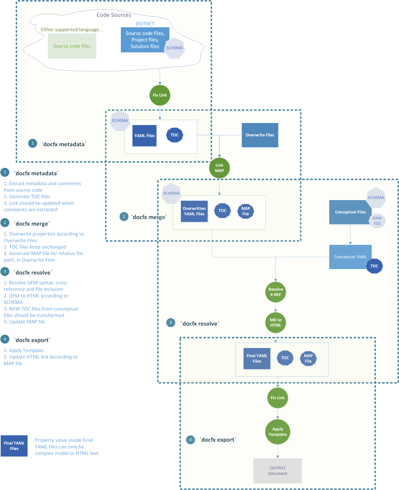

`docfx` Design Spec
====================================
## 0. Terms

Term | Description
-----|-------
DFM  | [DocFX Flavored Markdown](docfx_flavored_markdown.md)
API  | The API generated from source code
Overwrite Files | The files with YAML header used to override YAML files when `uid` matches.

## 1. Scenarios

`docfx` should support the following scenarios:

1. Source Code => Website
2. Conceptual => Website
3. YAML files => Website

<!--break list-->

## 2. Architecture

## 3. Feature List

1. Support for [DocFX Flavored Markdown](docfx_flavored_markdown.md)
2. Ability to parse TOC.json/TOC.yml/TOC.md
3. Custom template naming: {type}.{extension}.tmpl under folder {templateName} 

## 4. Open Issues

1. Should we support other conceptual file format, for example, RST?
==> How to parse?
2. How do you know which link to replace to html, and which not?
==> 
