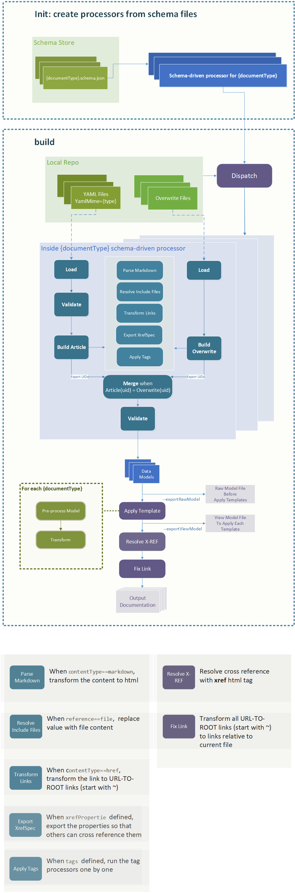

Schema-driven Document Processor(SDP) Design Spec
====================================

## 1. Overview
DocFX supports different [document processors](../tutorial/howto_build_your_own_type_of_documentation_with_custom_plug-in.md) to handle different kinds of input. With a new data model introduced in, a new document processor is required to support that model, even most of the code logic is the same for these processors. With this situation considered, a Schema-driven Document Processor (abbreviated to *SDP* below) is introduced to simplify the process. Togethor with a well defined [DocFX Document Schema](docfx_document_schema.md), SDP is able to *validate* and *process* a new data model with no extra effort needed.

## 2. Workflow
The workflow for SDP is illustrated below. In general, the schema file, with suggested naming convention, has `documentType` in its name, as `{documentType}`.schema.json (When `title` is defined in the schema file, `title` is considered as the `documentType` for this schema). `docfx` loads the schema files from `schemas` subfolder in `template` folder, and creates processors for these schema files with per schema file per processor. With data models are processed, `docfx` applies templates for that `documentType` to these data model, as details illustrated in [Template Introduction](../tutorial/intro_template.md#naming-rule-for-a-renderer-file) and generates output documentation.

