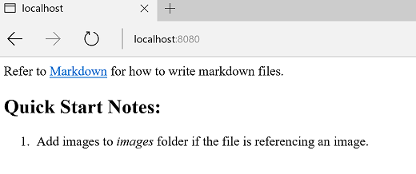
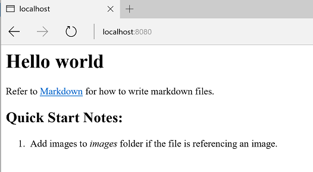
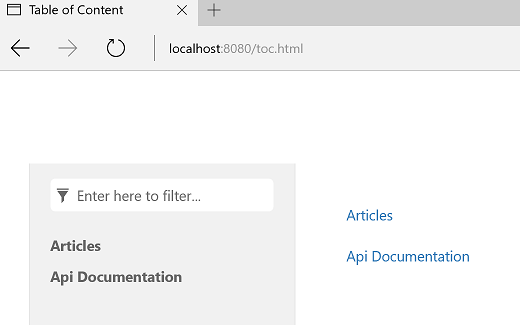

How-to: Create A Custom Template
===============================

Templates are organized as a zip package or a folder. The file path (without the `.zip` extension) of the zip package or the path of the folder is considered to be the template name.

Quickstart
---------------
Let's create a template to transform Markdown files into a simple html file.

### Step 1. Create a template folder
Create a folder for the template, for example, `c:/docfx_howto/simple_template`.

### Step 2. Add *Renderer* file
Create a file `conceptual.html.primary.tmpl` under the template folder with the following content:

```mustache
{{{conceptual}}}
```

Now a simple custom template is created.

You may notice that DocFX reports a warning message saying that: *Warning: [Build Document.Apply Templates]There is no template processing document type(s): Toc*. It is because our custom template only specifies how to handle document with type `conceptual`.

To test the output of the template, create a simple documentation project following [Walkthrough Part I](walkthrough/walkthrough_create_a_docfx_project.md) or download the [zipped documentation project](walkthrough/artifacts/walkthrough1.zip) directly.

In the documentation project, run `docfx build docfx.json -t c:/docfx_howto/simple_template --serve`. The `-t` command option specifies the template name(s) used by the current build.

Open http://localhost:8080 and you can see a simple web page as follows:



Add *Preprocessor* file
-----------------------
### Step 3. Add *Preprocessor* file
Sometimes the input data model is not exactly what *Renderer* wants, you may want to add some properties to the data model, or modify the data model a little bit before applying the *Renderer* file. This can be done by creating a *Preprocessor* file.

Create a file `conceptual.html.primary.js` under the template folder with the following content:

```javascript
exports.transform = function (model) {
    model._extra_property = "Hello world";
    return model;
}
```

Update the file `conceptual.html.primary.tmpl` with the following content:

```mustache
<h1>{{_extra_property}}</h1>
{{{conceptual}}}
```

In the documentation project, run `docfx build docfx.json -t c:/docfx_howto/simple_template --serve`.

Open http://localhost:8080 and you can see `_extra_property` is added to the web page.



Merge template with `default` template
------------------------------------------
DocFX contains some embedded template resources that you can refer to directly. You can use `docfx template list` to list available templates provided by DocFX.

Take `default` template as an example.

Run `docfx template export default`. It exports what's inside `default` template into the folder `_exported_templates`. You can see that there are sets of *Preprocessor* and *Renderer* files to deal with different types of documents.

DocFX supports specifying multiple templates for a documentation project. That allows you to leverage the `default` template for handling other types of documents, together with your custom template.

When dealing with multiple templates, DocFX merges the files inside these templates.

The principle for merging is: if a file name collides then the file in the latter template overwrites the one in the former template.

For example, you can merge `default` template and your custom template by calling `docfx build docfx.json -t default,c:/docfx_howto/simple_template`. Multiple templates are split by a comma `,` in the command line. Or you can define it in `docfx.json` by:
```
"build": {
    "template": [
        "default",
        "c:/docfx_howto/simple_template"
    ]
}
```

In the documentation project, run `docfx build docfx.json -t default,c:/docfx_howto/simple_template --serve`.

Now the warning message *There is no template processing document type(s): Toc* disappears because the default template contains *Renderer* to handle TOC files.

Open http://localhost:8080/toc.html and you can see a toc web page.


> [!Tip]
> Run `docfx template export default` to view what's inside the default template.
>
> [!Note]
> It is possible that DocFX updates its embedded templates when a new version is released.
> So please make sure to re-export the template if you overwrite or are dependent on it in your custom template.

Extension for *Preprocessor* file
----------------------------------
If you want to modify some properties based on DocFX `default` template's *Preprocessor*, you can use *Preprocessor* extension file to achieve this.

For example, if you want to add a property to the managed reference's data model after `default` template's *Preprocessor*, you can update the file `ManagedReference.extension.js` in your custom template with the following content:
```
/**
 * This method will be called at the start of exports.transform in ManagedReference.html.primary.js
 */
exports.preTransform = function (model) {
  return model;
}

/**
 * This method will be called at the end of exports.transform in ManagedReference.html.primary.js
 */
exports.postTransform = function (model) {
  model._extra_property = "Hello world";
  return model;
}
```
Compared with modifying `ManagedReference.html.primary.js` directly, you needn't worry about merging your custom templates with DocFX's embedded templates when DocFX updates.
