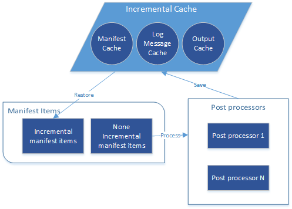

# Introduction to *DocFX Incremental Post Processing*

## Workflow

Overall, the output of all post processors would be cached in following:
1. Manifest items: to restore incremental manifest items.
2. Log message info: to replay the log message. 
3. Output files: to restore the post processing outputs.

Based on incremental build result, `IsIncremental` flag of the manifest item could hint whether the item is incremental or not. 
1. If the post processing meets [Incremental Condition](#incremental-condition):
   1. For the incremental manifest items, restore from cache.
   2. For the non-incremental manifest items, they will be handled by post processors, and save the information into cache at the same time.
2. If the post processing doesn't meet [Incremental Condition](#incremental-condition), set `IsIncremental` flag to false to all manifest items, then they will be handled by post processors. 

## Incremental Condition

The post processing could be incremental only if it meets all of the following conditions:
1. Both last cache file [`build.info`](advanced_cache_file_structure.md) and its [`PostProcessInfo`](advanced_cache_file_structure.md#postprocessinfo-model) exist, which is essential to restore the last incremental post processing info.
2. Not set option `forcePostProcess` and `force` of build command or `docfx.json` config, to enable incremental post processing.
3. Post processor requirement:
   1. Each of the post processor implements @Microsoft.DocAsCode.Plugins.ISupportIncrementalPostProcessor. Currently, @Microsoft.DocAsCode.Build.Engine.HtmlPostProcessor implements the interface while @Microsoft.DocAsCode.Build.Engine.ExtractSearchIndex does not. Refer to [Customize a post processor to be incremental](customize_a_post_processor_to_be_incremental.md) for more details.
   2. Post processor number isn't changed.
   3. Each post processor's `IncrementalContextHash` isn't changed

