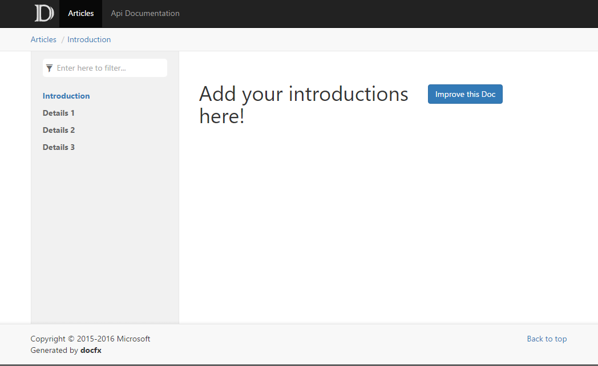

Walkthrough Part I: Generate a Simple Documentation Website
===================================

By completing this walkthrough, you'll become familiar with the workflow of `docfx` and the general principle of organizing documents inside `docfx`. You will finish this walkthrough with a static website that can be published to any host service. Download the files used in this walkthrough [here](artifacts/walkthrough1.zip).

Step1. Setup DocFX
------------------------
Download *docfx* from http://dotnet.github.io/docfx/. [Getting Started with docfx](http://dotnet.github.io/docfx/tutorial/docfx_getting_started.html#2-use-docfx-exe-directly) describes three ways to install *docfx*. This walkthrough uses the first one: Use *docfx.exe* directly.

1. Download *docfx.zip* and unzip it to `D:\docfx\`
2. Add `D:\docfx\` to `PATH` so that the command `docfx` can be directly called from everywhere for convenience. (For example, for Windows, `set PATH=%PATH%;D:\docfx\`.)

Step2. Init a DocFX project
---------------------------
1. Create a new folder `D:\docfx_walkthrough`
2. Start Command Line under `D:\docfx_walkthrough`
3. Call `docfx init -q`. This command generates a `docfx_project` folder with the default `docfx.json` file under it. `docfx.json` is the configuration file `docfx` uses to generate documentation. `-q` option means generating the project quietly using default values, you can also try `docfx init` and follow the instructions to provide your own settings.

Step3. Build our website
-----------------------
Run command `docfx docfx_project/docfx.json`. Note that a new subfolder `_site` is generated under that folder. This is where the static website is generated.

Step4. Preview our website
-------------------------
The generated static website can be published to GitHub pages, Azure websites, or your own hosting services without any further changes. You can also run command `docfx serve docfx_project/_site` to preview the website locally.

If port `8080` is not in use, `docfx` will host `_site` under `http://localhost:8080`. If `8080` is in use, you can use `docfx serve _site -p <port>` to change the port to be used by `docfx`.

Congrats! You can now see a simple website similar to:


----------------------

Step5. Add a set of articles to the website
-------------------------
1. Place more `.md` files into `articles`, e.g., `details1.md`, `details2.md`, `details3.md`. If the files reference any resources, put those resources into the `images` folder.
2. In order to organize these articles, we add these files into `toc.yml` under `articles` subfolder. The content of `toc.yml` is as below:

    ```yml
    - name: Introduction
      href: intro.md
    - name: Details 1
      href: details1.md
    - name: Details 2
      href: details2.md
    - name: Details 3
      href: details3.md
    ```
    
    So now our folder layout is:
    ```
    |- index.md
    |- toc.yml
    |- articles
    |    |- intro.md
    |    |- details1.md
    |    |- details2.md
    |    |- details3.md
    |    |- toc.yml
    |- images
        |- details1_image.png
    ```
4. Run **Step3** and **Step4** again, and the website is now:
.

Notice that more items are added to the sidebar for *Articles* nav page. The title inside the sidebar is exactly what we set in the `toc.yml` inside `articles` subfolder.

Conclusion
---------
In this walkthrough, we built a website from a set of `.md` files. We call these `.md` files **Conceptual Documentation**. In walkthrough part 2, we will learn to add **API Documentation** to our website. The **API Documentation** is extracted directly from .NET source code. In a series of advanced walkthroughs, we will learn advanced concepts in `docfx`, such as *cross reference* between articles, *external reference* to other documentation sets, etc. We will also learn to customize our websites, from theme to layout to metadata extraction.

Read more
---------
* [Walkthrough Part II: Adding API Documentation to the Website](walkthrough_create_a_docfx_project_2.md)

* [Walkthrough Advanced: Customize Your Website](advanced_walkthrough.md)
