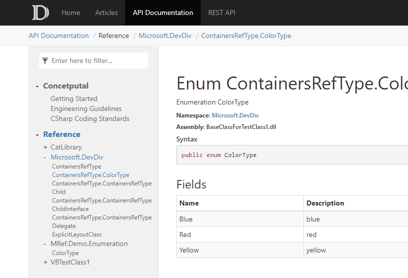

Walkthrough Part II: Adding API Documentation to the Website
==========================

After completing [Walkthrough Part I: Generate a Simple Documentation Website](walkthrough_create_a_docfx_project.md), we built a website from a set of `.md` files. We call it **Conceptual Documentation**. In this walkthrough, we will learn to build a website from .NET source code, which is called **API Documentation**. We will also integrate **Conceptual Documentation** and **API Documentation** into one website so that we can navigate from **Conceptual** to **API**, or **API** to **Conceptual** seamlessly. Download the files used in this walkthrough [here](artifacts/walkthrough2.zip).

After completing walkthrough part I, our `D:\docfx_walkthrough\docfx_project` folder is in the following structure:

```
|- index.md
|- toc.yml
|- articles
|    |- intro.md
|    |- details1.md
|    |- details2.md
|    |- details3.md
|    |- toc.yml
|- images
     |- details1_image.png
|- api
     |- index.md
     |- toc.yml
```

Step1. Add a C# project
---------------------------
Create a subfolder `src` under `D:\docfx_walkthrough\docfx_project`. Open *Visual Studio Community 2015* (or an above version) and create a **C# Class Library** `HelloDocfx` under folder `src`. In the `Class1.cs`, add some comments and methods to this class, similar to:

```csharp
namespace HelloDocfx
{
    /// <summary>
    /// Hello this is **Class1** from *HelloDocfx*
    /// </summary>
    public class Class1
    {
        private InnerClass _class;
        public int Value { get; }

        /// <summary>
        /// This is a ctor
        /// </summary>
        /// <param name="value">The value of the class</param>
        public Class1(int value)
        {
            Value = value;
        }

        public double ConvertToDouble()
        {
            return Value;
        }

        /// <summary>
        /// A method referencing a inner class
        /// </summary>
        /// <param name="name">The name</param>
        /// <param name="inner">A inner class with type <seealso cref="InnerClass"/></param>
        public void SetInnerClass(string name, InnerClass inner)
        {
            inner.Name = name;
            _class = inner;
        }

        public class InnerClass
        {
            public string Name { get; set; }
        }
    }
}
```

Step2. Generate metadata for the C# project
----------------------
Execute `docfx metadata` under `D:\docfx_walkthrough\docfx_project`. `docfx metadata` is a subcommand registered in `docfx`, and it reads configuration in the `metadata` section of `docfx.json`. `[ "src/**.csproj" ]` in `metadata/src/files` tells `docfx` to search for `csproj` files in the `src` subfolder to generate metadata.

```json
"metadata": [
    {
      "src": [
        {
          "files": [
            "src/**.csproj"
          ],
          "exclude": [
            "**/bin/**",
            "**/obj/**",
            "_site/**"
          ]
        }
      ],
      "dest": "api"
    }
  ]
```

This generates several `YAML` files in the `api` folder. The `YAML` file contains the data model extracted from the C# source code file. YAML is the metadata format used in `docfx`. [General Metadata Spec](http://dotnet.github.io/docfx/spec/metadata_format_spec.html) defines the general schema, and [.NET Metadata Spec](http://dotnet.github.io/docfx/spec/metadata_dotnet_spec.html) defines the metadata schema for .NET languages that `docfx` can consume.
```
|- HelloDocfx.Class1.InnerClass.yml
|- HelloDocfx.Class1.yml
|- HelloDocfx.yml
|- toc.yml
```

Also, note that if your csproj files are located outside of your docfx directory, you need to use the `src` property with `../` to find them: 
```json
"metadata": [
    {
      "src": [
        {
          "src": "../../",
          "files": [
            "somewhere/src/**.csproj"
          ],
          "exclude": [
            "**/bin/**",
            "**/obj/**",
            "_site/**"
          ]
        }
      ],
      "dest": "api"
    }
  ]
```

Step3. Build and preview our website
----------------------------------------------------
Run the command `docfx`. `docfx` reads `docfx.json` and executes subcommands defined in the config file one by one. Our `docfx.json` defines `metadata` and `build`, so by running `docfx`, we are actually executing `docfx metadata` and `docfx build`, and thus generating the website.

Run `docfx serve _site`, and the website is now:
.

Step4. Add another API documentation
----------------------------------------------------
Create another subfolder `src2` under `D:\docfx_walkthrough\docfx_project`. Besides generating API documentation from project files, `docfx` can generate documentation directly from source code. Let's create a `Class2.cs` as similar to:

```csharp
namespace HelloDocfx
{
    /// <summary>
    /// Hello this is **Class2** from *HelloDocfx*
    /// </summary>
    public class Class2
    {
        private InnerClass _class;
        public int Value { get; }

        /// <summary>
        /// This is a ctor
        /// </summary>
        /// <param name="value">The value of the class</param>
        public Class2(int value)
        {
            Value = value;
        }

        public double ConvertToDouble()
        {
            return Value;
        }

        /// <summary>
        /// A method referencing a inner class
        /// </summary>
        /// <param name="name">The name</param>
        /// <param name="inner">A inner class with type <seealso cref="InnerClass"/></param>
        public void SetInnerClass(string name, InnerClass inner)
        {
            inner.Name = name;
            _class = inner;
        }

        public class InnerClass
        {
            public string Name { get; set; }
        }
    }
}
```

Add it to the `metadata` section of our `docfx.json` as follows.

```json
"metadata": [
    {
      "src": [
        {
          "files": [
            "src/**.csproj"
          ],
          "exclude": [
            "**/bin/**",
            "**/obj/**",
            "_site/**"
          ]
        }
      ],
      "dest": "api"
    },
    {
      "src": "src2/**.cs",
      "dest": "api-vb"
    }
  ]
```

What it means is that the YAML metadata files for "src2/**.cs" are generated into "api-vb" folder. Let's also include the generated YAML files in `build` section:
```json
  "build": {
    "content": [
      {
        "files": [
          "api-vb/**.yml"
        ]
      }
      ...
```

For it to be organized and shown to website, we also need to modify our `D:\docfx_walkthrough\docfx_project\toc.yml` file. Don't forget to append slash `/` for the value of `href`.

```
- name: Articles
  href: articles/
- name: Api Documentation
  href: api/
  homepage: api/index.md
- name: Another Api Documentation
  href: api-vb/
```

Now, let's run `docfx --serve` again, and the website is now:
.

Step5. Combine conceptual and reference information in the left-side nav bar.
------------------------------------------------------------------------------
The left-side nav bar can contain links to both conceptual information (overview, getting started, etc.) and reference information. In this example, assume that this is the `toc.yml` file at root. (It determines what's in the main horizontal menu bar.)

```yml
- name: Home
  href: index.md
- name: Articles
  href: articles/
- name: API Documentation
  href: obj/api/
- name: REST API
  href: restapi/
  ```

Add a new folder at root (e.g., `fusion`).

Inside `fusion`, add `toc.yml`:

```
- name: Conceptual
  href: ../articles/toc.yml
- name: Reference
  href: ../obj/api/toc.yml
```
In `toc.yml` at root, replace the link to `../obj/api/toc.yml` with the path to `fusion`:

```yml
- name: Home
  href: index.md
- name: Articles
  href: articles/
  homepage: articles/docfx_getting_started.md
- name: API Documentation
  href: fusion/
- name: REST API
  href: restapi/
```

Add the `fusion` folder in `docfx.json` so the project includes it:

```json
"content": [
  { 
    "files": "fusion/**"
  }
]
```
The output:

.

The [docfx-seed sample project repo](https://github.com/docascode/docfx-seed) is another example of this kind of setup.

More details: http://dotnet.github.io/docfx/tutorial/intro_toc.html#link-to-another-toc-file

Conclusion
---------
In this walkthrough, we built a website containing both **Conceptual Documentation** and **API Documentation**. In the upcoming series of walkthroughs, we will learn advanced concepts in `docfx`, such as *cross reference* between articles, *external reference* to other documentations, etc. We will also learn to customize our websites, from theme to layout to metadata extraction.

Read more
---------
* [Walkthrough Part I: Generate a Simple Documentation Website](walkthrough_create_a_docfx_project.md)

* [Walkthrough Advanced: Customize Your Website](advanced_walkthrough.md)
