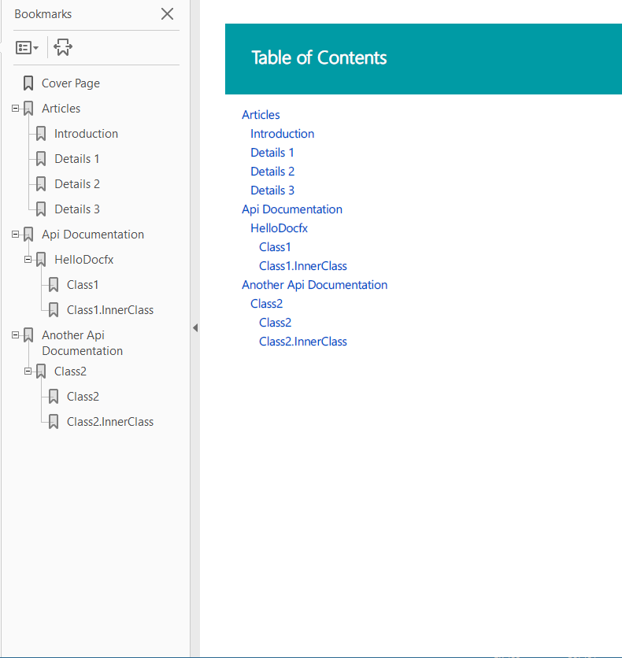

Walkthrough Part III: Generate PDF Documentation
==========================

After completing [Walkthrough Part II: Add API Documentation to the Website](walkthrough_create_a_docfx_project_2.md), we successfully create a website containing both Conceptual and API documentation. In this section, we will generate PDF files for these articles.

After completing walkthrough part II, our `D:\docfx_walkthrough\docfx_project` folder is in the following structure(Download the artifacts [*HERE*](artifacts/walkthrough3.zip)):

```
|- articles
|- images
|- src
|- src2
|- index.md
|- toc.yml
|- docfx.json
```

Step0. Install prerequisite 
---------------------------
We leverage [wkhtmltopdf](https://wkhtmltopdf.org/) to generate PDF. [Download wkhtmltopdf](https://wkhtmltopdf.org/downloads.html) to some folder, e.g. `E:\Program Files\wkhtmltopdf\`, and save the executable folder path to **%PATH%** by: `set PATH=%PATH%;E:\Program Files\wkhtmltopdf\bin`.

> [!NOTE]
> Alternativeley you can install wkhtmltopdf via [chocolatey](https://chocolatey.org/) with `choco install wkhtmltopdf`. This will also add the executable folder to **%PATH%** during installation.

Step1. Add a toc.yml specific for PDF
---------------------------
Current design is that each TOC file generates a corresponding PDF file, TOC is also used as the table of contents page of the PDF, so we create a `toc.yml` file specific for PDF under a new folder `pdf`, using [TOC Include](http://dotnet.github.io/docfx/tutorial/intro_toc.html?q=toc%20inclu#link-to-another-toc-file) to include content from other TOC files.
```yml
- name: Articles
  href: ../articles/toc.yml
- name: Api Documentation
  href: ../api/toc.yml
- name: Another Api Documentation
  href: ../api-vb/toc.yml
```

Step2. Add *pdf* section into docfx.json
----------------------------------------------------
Parameters are similar to `build` section, definitely it is using a different template (the builtin template is `pdf.default`), with another output destination. We also exclude TOC files as each TOC file generates a PDF file:
```json
...
  "pdf": {
    "content": [
      {
        "files": [
          "api/**.yml",
          "api-vb/**.yml"
        ],
        "exclude": [
          "**/toc.yml",
          "**/toc.md"
        ]
      },
      {
        "files": [
          "articles/**.md",
          "articles/**/toc.yml",
          "toc.yml",
          "*.md",
          "pdf/*"
        ],
        "exclude": [
          "**/bin/**",
          "**/obj/**",
          "_site_pdf/**",
          "**/toc.yml",
          "**/toc.md"
        ]
      },
      {
        "files": "pdf/toc.yml"
      }
    ],
    "resource": [
      {
        "files": [
          "images/**"
        ],
        "exclude": [
          "**/bin/**",
          "**/obj/**",
          "_site_pdf/**"
        ]
      }
    ],
    "overwrite": [
      {
        "files": [
          "apidoc/**.md"
        ],
        "exclude": [
          "**/bin/**",
          "**/obj/**",
          "_site_pdf/**"
        ]
      }
    ],
    "wkhtmltopdf": {
      "additionalArguments": "--enable-local-file-access"
    },
    "dest": "_site_pdf"
  }
```

Now, let's run `docfx`, and you can find pdf file walkthrough3_pdf.pdf generated under `_site_pdf` folder:


*Optional* Step3. Enable plugins
----------------------------------------------------
If you wish to use plugins with pdf as well, you need to add a `template` node to the pdf section. It needs to start with the `pdf.template` followed by the path to the plugins you want to use:

```json
"template": [
  "pdf.default",
  "pluginPackages/rest.tagpage.2.31.0/content" 
],
```

Conclusion
---------
In this walkthrough, we build a PDF file according to the TOC file under `pdf` folder. Note that TOC plays an important role in PDF generation, it not only determines the files included in the PDF, but also the table of contents page for this PDF file. One TOC file generates one PDF file, so don't forget to exclude TOC files you don't want from docfx.json.

Read more
---------
* [Walkthrough Part I: Generate a Simple Documentation Website](walkthrough_create_a_docfx_project.md)

* [Walkthrough Part II: Adding API Documentation to the Website](walkthrough_create_a_docfx_project_2.md)

* [Walkthrough Advanced: Customize Your Website](advanced_walkthrough.md)
