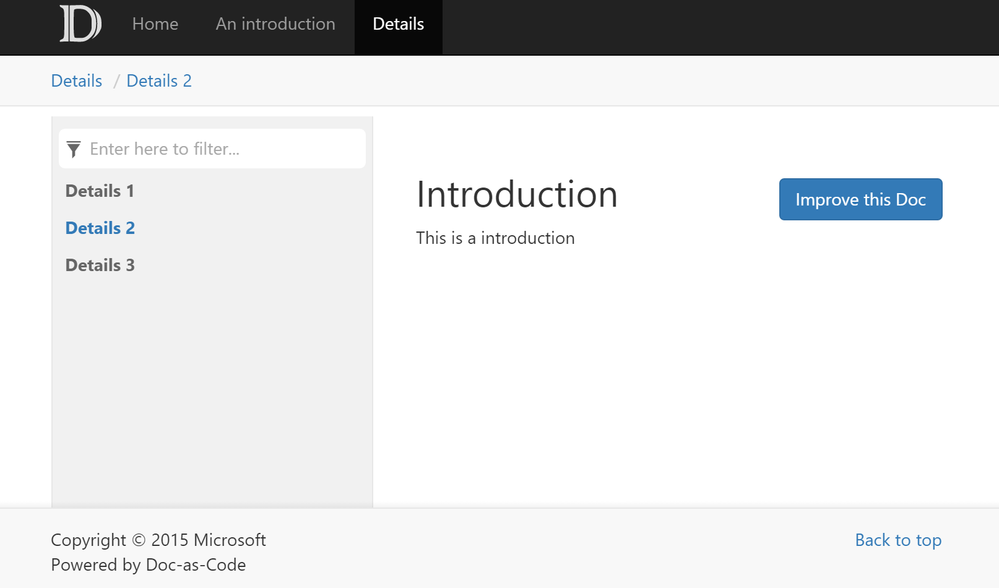

Walkthrough Part I: Generate a Simple Documentation Website
===================================

By completing this walkthrough, you'll become familiar with the workflow of `docfx` and the general principle of organizing documents inside `docfx`. You will finish this walkthrough with a static website that can be published to any host service. Download the files used in this walkthrough [here](../artifacts/walkthrough1.zip).

Step1. Setup docfx
------------------------
Download *docfx* from http://dotnet.github.io/docfx/. [Getting Started with docfx](http://dotnet.github.io/docfx/tutorial/docfx_getting_started.html#2-use-docfx-exe-directly) describes 3 ways to install *docfx*. This walkthrough uses the first one: use *docfx.exe* directly.

1. Download *docfx.zip* and unzip it to `D:\docfx\`
2. Add `D:\docfx\` to `PATH` so that command `docfx` and be directly called from everywhere for convenience. E.g. for Windows, `setx PATH "%PATH%;D:\docfx\"`

Step2. Init a docfx project
---------------------------
1. Create a new folder `D:\docfx_walkthrough`  
2. Start Command Line under `D:\docfx_walkthrough`
3. Call `docfx init -q`. This command generates a `docfx.json` file under the same folder. `docfx.json` is the configuration file `docfx` uses to generate documentation. `-q` option means generating `docfx.json` quitely using default value, you can also try `docfx init` and follow the instructions to provide your own settings.

Step3. Create the homepage for our website
------------------------------------------
Create a file named `index.md` and add some content to it. `index.md` will be the homepage for our website. `.md` files are written in *markdown* syntax. [Markdown](http://daringfireball.net/projects/markdown/) is a lightweight markup language, and is the syntax `docfx` supported for writing documentations.

```md
Welcome to the world of docfx!
=============================

Hello *everyone*.
```

Step4. Build our website
-----------------------
Run command `docfx build`. Note that a new subfolder `_site` is generated under the same folder. This is where the static website is generated.

Step5. Preview our website
-------------------------
The generated static website can be published to github pages, azure websites, or your own hosting service without any further changes. You can also run command `docfx serve _site` to preview the website locally.

If port `8080` is not in use, `docfx` will host `_site` under `http://localhost:8080`. If `8080` is in use, you can use `docfx serve _site -p <port>` to change the port to be used by `docfx`.

Congrats! You can now see a simple website similar to:


----------------------

Step6. Add more articles to the website
-------------------------
1. Create subfolder `articles` and `images` under `D:\docfx_walkthrough`
2. Place a `.md` file to `articles`, e.g. `introduction.md`. If the file references to any resources, put the resources into `images` folder.
3. In order to navigate to this article, we create a file named `toc.yml` under `D:\docfx_walkthrough`. This file tells `docfx` the navigation title for the article, and where is the article. The content of `toc.yml` is as below:

    ```yml
    - name: Home
      href: index.md
    - name: An introduction
      href: articles/introduction.md
    ```

    So now our folder layout is:
    ```
    |- index.md
    |- toc.yml
    |- articles
    |    |- introduction.md
    |- images
        |- introduction_image1.png
    ```
4. Run **Step4** and **Step5** again, and the website is now:
.

Noticed a navigation bar is shown at the top of the website, the title for the navigation bar is what you set in `name` in `toc.yml`


Step7. Add a set of articles to the website
-------------------------
1. Place more `.md` files to `articles`, e.g. `details1.md`, `details2.md`, `details3.md`. If the file references to any resources, put the resources into `images` folder.
2. In order to organize these articles, we create a file named `toc.yml` under `articles` subfolder. The content of `toc.yml` is as below:

    ```yml
    - name: Details 1
      href: details1.md
    - name: Details 2
      href: details2.md
    - name: Details 3
      href: details3.md
    ```
4. In order to navigate to the set of articles, we update `toc.yml` under `D:\docfx_walkthrough` to as below:

    ```yml
    - name: Home
      href: index.md
    - name: An introduction
      href: articles/introduction.md
    - name: Details
      href: articles/
    ```
    Note that a `/` must be appended to the folder name so that `docfx` knows it should contain a set of articles instead of one article.
    
    So now our folder layout is:
    ```
    |- index.md
    |- toc.yml
    |- articles
    |    |- introduction.md
    |    |- details1.md
    |    |- details2.md
    |    |- details3.md
    |    |- toc.yml
    |- images
        |- introduction_image1.png
    ```
4. Run **Step4** and **Step5** again, and the website is now:
.

Noticed a new navigation bar named **Details** is shown at the top of the website, and a sidebar is shown on the left side, the title inside the sidebar is exactly what we set in the `toc.yml` inside `articles` subfolder.

Conclusion
---------
In this walkthrough, we build a website from a set of `.md` files. We call these `.md` files **Conceptual Documentation**. In walkthrough part 2, we will learn to add **API Documentation** to our website. The **API Documentation** is extracted directly from .NET source code. And in series of advanced walkthroughs, we will learn advanced concepts in `docfx`, such as *cross reference* between articles, *external reference* to other documentations, etc. We will also learn to customize our websites, from theme to layout to metadata extraction.

Read more
---------
* [Walkthrough Part II: Adding API Documentation to the Website](walkthrough_create_a_docfx_project_2.md)

* [Walkthrough Advanced: Customize Your Website](advanced_walkthrough.md)