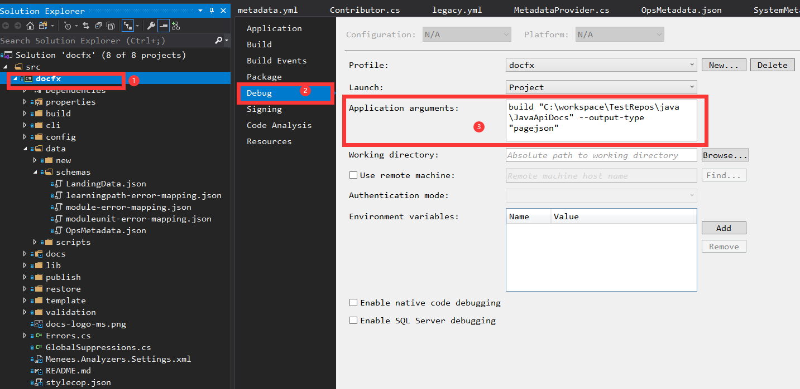

# Local Debug Tutorial for Docfx v3

> **Before clone this repo:**
>
> Make sure you have the permissions to run this repo locally. Ask [Yufei](https://github.com/yufeih) for permissions.

## Get Start Quickly

### Step 1: Clone Repo
Clone the repo and check out to v3 branch.

```shell
git clone https://github.com/dotnet/docfx
git checkout v3
```
### Step 2: Open the Repo with Visual Studio

Open `docfx.sln` with Visual Studio. Add `Debug arguments` to specify the repo you want to debug.



### Step 3: Debug

Now you can set breakpoints and debug with your specified repo.


## More Options:

You can find more options in [Docfx.cs](../src/docfx/cli/Docfx.cs)
