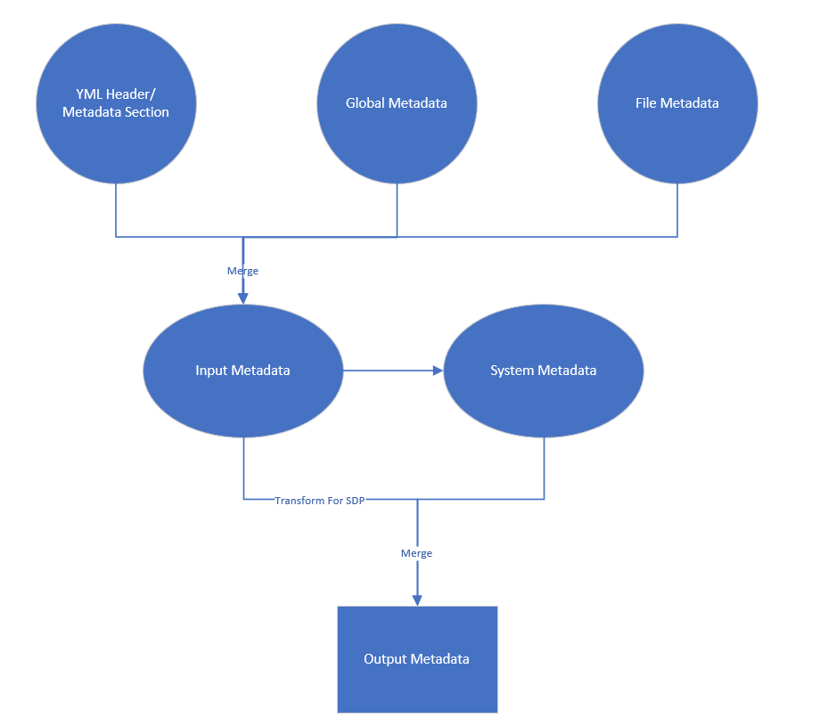
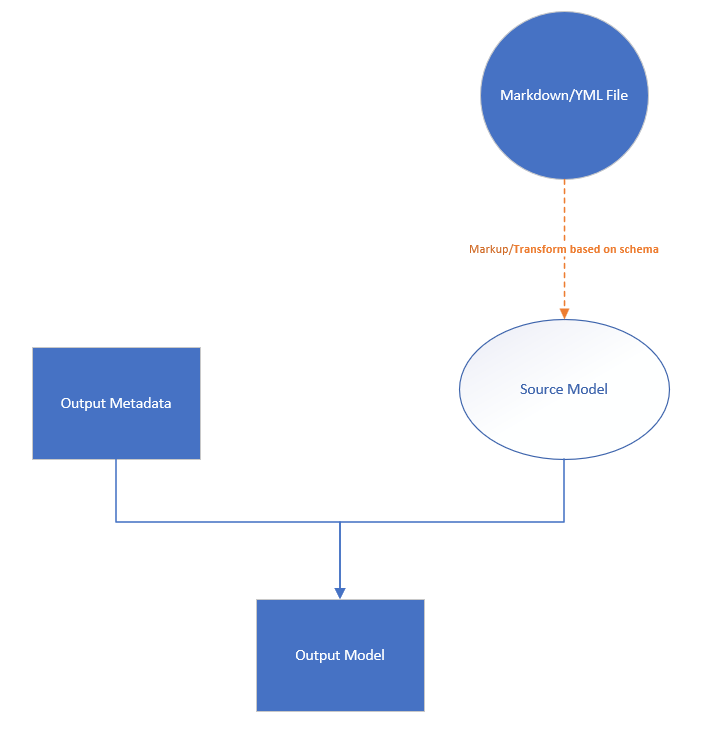
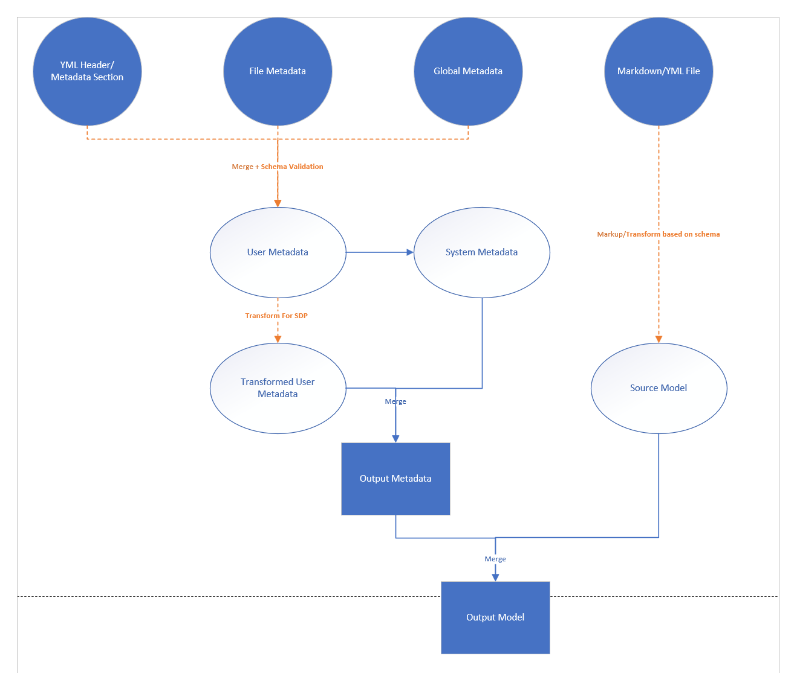
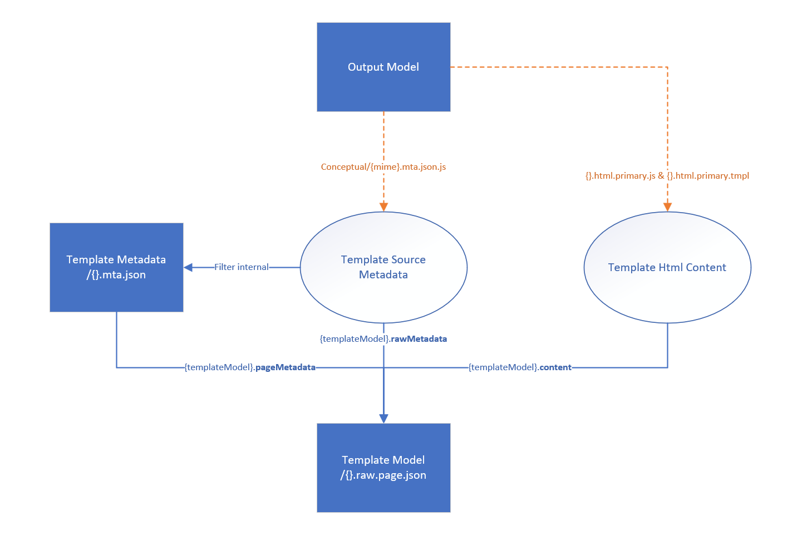
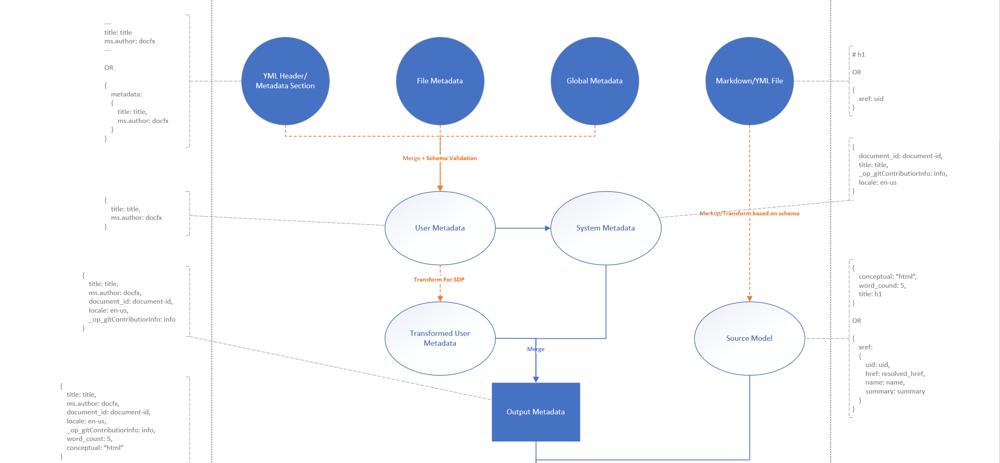
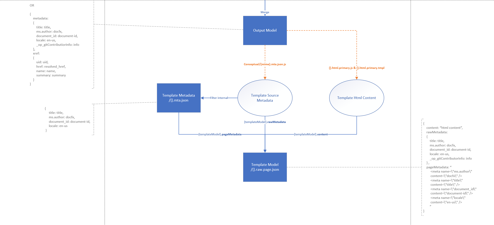

# Build page workflow

> It doesn't include the build workflow for Data Model(like `ContextObject`), docfx treat Data Model as resource, the output of Data Model is the transformed input.

## Input

- markdown file (conceptual)
  - markdown content
  - metadata defined in `yml header`

- yml/json file (schema driven)
  - input model
  - metadata defined in `metadata` section

- config file
  - global metadata
  - file metadata

## Build Metadata

> `Rectangle parts` represent build outputs(metadata)  
> `Schema Validation` including Template Json Schema and Validation Service Json Schema

### Workflow
  
  

### Details
- Get `User Metadata` from file(`yml header` or `metadata section`) & config(`global/file metadata`)

  *markdown example:*
  ```md
  ---
  ms.author: docfx
  author: docfx
  ms.updated_at: "8/13/2019"
  ---

  # title
  markdown content
  ```

  *yml example:*
  ```yml
  metadata: 
    ms.author: docfx
    author: docfx
    ms.updated_at: "8/13/2019"
  xref: uid
  ```

- Create `System Metadata` (including `document_id`, `git_content_url`...) based on `User Metadata`

  *system metadata example:*
  ```json
  {
      "document_id": "58f52203-474e-4b6e-bb85-13cedd56575e",
      "git_content_url": "https://github.com/dotnet/docfx/docs/build-page.md",
      "locale": "en-us",
      "canonical_url": "https://learn.microsoft.com/docfx/build-page"
      ...
  }
  ```

- [SDP] Transform `User Metadata` based on `JSON Schema`

- Merge `System Metadata` into `User Metadata` to create `Output Metadata`
 
  *system metadata example:*
  ```json
  {
    "ms.author": "docfx",
    "ms.updated_at": "8/13/2019",
    "author": "docfx",
    "document_id": "58f52203-474e-4b6e-bb85-13cedd56575e",
    "git_content_url": "https://github.com/dotnet/docfx/docs/build-page.md",
    "locale": "en-us",
    "canonical_url": "https://learn.microsoft.com/docfx/build-page"
    ...
  }
  ```

## Build Model

> `Rectangle parts` represent build outputs(model)

### Workflow

  

### Details
- [Conceptual] Markup markdown content to create `Source Model`

  *conceptual source model example:*
  ```json
  {
      "conceptual": "html content",
      "word_count": 5,
      "title": "title",
      "raw_title": "raw_title",
  }
  ```

- [SDP] Transform `Input Model` based on `JSON Schema` to create `Source Model`

  *sdp json schema example*:
  ```json
  {
    "type": "object",
    "properties":
    {
      "metadata":
      {
        "type": "object",
        "properties": 
        {
          "title": 
          {
            "type": "string"
          }
        }
      },
      "xref":
      {
        "type": "string",
        "contentType": "xref"
      }  
    }    
  }
  ```

  *sdp source model example:*
  ```json
  {
      "metadata": 
      {
          "ms.author": "docfx",
          "author": "author",
          "title": "title",
      },
      "xref":
      {
          "uid": "uid",
          "href": "resolved href",
          "display_name": "display name"
      }
  }
  ```
- Create `Output Model` based on the merging of:

    - `Source Model`

    - `Output Metadata`

  > Merge order: `Output Metadata` -> overwrite -> `Source Model`

## Outputs

> `Rectangle parts` represent outputs(metadata + model)

### Workflow

  

## Apply Template

### Interfaces

- `{}.mta.json.js` is to process `Output Model` to generate `Template Metadata`

- `{}.html.primary.js` and `{}.html.primary.tmpl` is to process `Output Model` to generate `Template Html Content`

### Workflow

  

### Details

- Create `Template Source Metadata` from running `Conceptual/{MIME}.mta.json.js` against `Output Model`

  *template source metadata example:*
  ```json
  {
    "title": "title",
    "author": "docfx",
    "document_id": "58f52203-474e-4b6e-bb85-13cedd56575e",
    "_op_raw_title": "internal raw title",
    "_op_gitContributorInformation": {
      "updated_at": "8/13/2019",
      "contributors": [
        {
          "name": "docfx",
          "email": "docfx@microsoft.com"
        }
      ]
    }  
  }
  ```

- Create `Template Metadata` based on `Template Source Metadata`(filter out internal only metadata)

  *template output metadata(.mta.json) example:*
  ```json
  {
    "title": "title",
    "author": "docfx",
    "document_id": "58f52203-474e-4b6e-bb85-13cedd56575e"
  }
  ```

- [Conceptual] Get `Template Html Content` from `Output Model`(`markup result`)

- [SDP] Create `Template Html Content` from running `{MIME}.html.primary.js` and `{MIME}.html.primary.tmpl` against `Output Model`.

- Create `Template Model` based on:
  - `Template Metadata`(processed)
  - `Template Html Content`

  *template output model(.raw.page.json) example:*
  ```json
  {
      "content": "template html content",
      "RawMetadata": {
        "title": "title",
        "author": "docfx",
        "document_id": "58f52203-474e-4b6e-bb85-13cedd56575e",
        "_op_raw_title": "internal raw title",
        "_op_gitContributorInformation": {
          "updated_at": "8/13/2019",
          "contributors": [
            {
              "name": "docfx",
              "email": "docfx@microsoft.com"
            }
          ]
        }  
      },
      "PageMetadata": "html metadata",
  }
  ```
## Overall




## Open Questions

- To create `System Metadata` for SDP files, do we use transformed `User Metadata` or original `User Metadata` ?
  For example, if the metadata `title` content type is `markdown` defined in the schema, The generated `title` of `System Metadata` is marked up or not?
