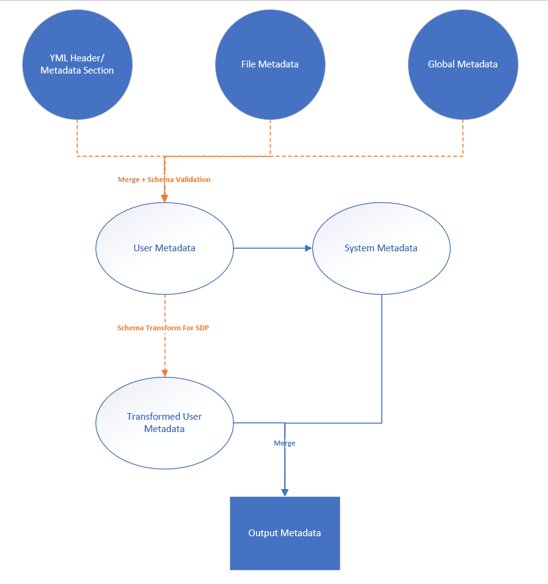

# Build page workflow

## Input

- markdown file (conceptual)
  - markdown content
  - metadata defined in `yml header`

- yml/json file (schema driven)
  - input model
  - metadata defined in `metadata` section

- config file
  - global metadata
  - file metadata

## Build Metadata

> `Rectangle parts` represent build outputs(metadata)

### Workflow
  
  

### Details
- Get `Input Metadata` from file(`yml header` or `metadata section`) & config(`global/file metadata`)
  ```md
  ---
  ms.author: docfx
  author: docfx
  ms.updated_at: 8/13/2019
  ---

  markdown content
  ```

- Create `System Metadata` (including `document_id`, `git_content_url`...) based on `Input Metadata`
  ```json
  {
      "document_id": "abc",
      "git_content_url": "https://github.com/dotnet/docfx/docs/build-page.md",
      "locale": "en-us",
      "canonical_url": "https://docs.microsoft.com/docfx/build-page"
      ...
  }
  ```

- [SDP] Transform `Input Metadata` based on `Schema`

- Merge `System Metadata` into `Input Metadata` to create `Output Metadata`

## Build Model

> `Rectangle parts` represent build outputs(model)

### Workflow

  

### Details
- [Conceptual] Markup markdown content to create `Intermediate Model`
  ```json
  {
      "conceptual": "html content",
      "word_count": 5,
      "title": "title",
      "raw_title": "raw_title",
  }
  ```

- [SDP] Transform `Input Model` based on `Schema` to create `Intermediate Model`
  ```json
  {
      "metadata": 
      {
          "title": "title",
          "summary": "summary",
      },
      "xref":
      {
          "uid": "uid",
          "href": "resolved href",
          "display_name": "display name"
      }
  }
  ```
- Create `Output Model` based on the merging of:

    - `Intermediate Model`

    - `Output Metadata`

## Outputs

> `Rectangle parts` represent outputs(metadata + model)

### Worlflow

  

## Apply Template

### Interfaces

- `{}.mta.json.js` is to process `Output Model` to generate `Template Metadata`

- `{}.html.primary.js` and `{}.html.primary.tmpl` is to process `Output Model` to generate `Template Html Content`

### Workflow

  

### Details

- Create `Template Intermediate Metadata` from running `Conceptual/{MIME}.mta.json.js` against to `Output Model`

- Create `Template Metadata` based on `Template Intermediate Metadata`(filter out internal only metadata)

- [Conceptual] Get `Template Html Content` from `Output Model`(`markup result`)

- [SDP] Create `Template Html Content` from running `{MIME}.html.primary.js` and `{MIME}.html.primary.tmpl` against to `Output Model`.

- Create `Template Model` based on:
  - `Template Metadata`(processed)
  - `Template Html Content`
  ```json
  {
      "content": "template html content",
      "RawMetadata": "template intermediate metadata",
      "PageMetadata": "template metadata tags",
  }
  ```