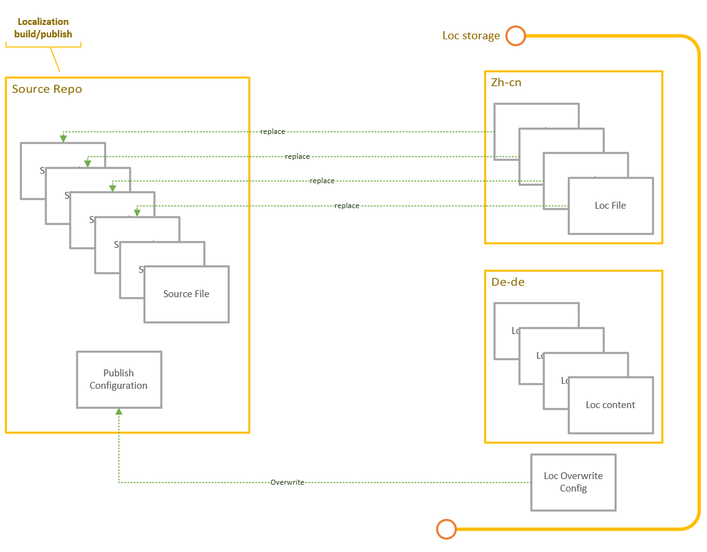

# Localization Support

## Description

DocFX build supports localization contents, there are a few features need to be supported for localization contents:
  - Partial contents: the localization contents are often a part of source content.
  - Localization contents are not required to be stored in the same repo of source content, they can be everywhere.
  - Localization publishing may have a few specific requirements which are different with source publishing, they need overwrite the source configuration

## Design

- Treats localization content as the replacing content of source content, they are not independent repo for publishing but only stores the corresponding loc content.
- Localization publishing mixes the loc content and source content, loc content has higher priority to replace the source content.
- Localization publishing uses source configuration and localization overwrite configuration

## Workflow

### Loc Content as Assets of Source Repo 

  - No more specified fallback features, there is always mixed (Loc + Source) full set content for build/publishing  
  - All features are equal to Source + Loc, less Loc repo specified features  
  - Less Loc configurations to maintain and configuration changes in source repo will immediately be applied to Loc  
  - Loc content can be stored in any places(one repo or multiple repo), what we need is the **mappings between Source content and Loc content**  

### Loc Overwrite Configuration

  - Overwrite the configurations you want or use source configuration by default  
  - Focus the Loc publishing configuration controlling, like bilingual or contribution.  
  - Source configuration changing will be immediately applied to Loc, no more manually sync.
  - No more repo level configs, all configurations are branch level configuration.  
  - One configuration dashboard to support maintain all configurations.  
