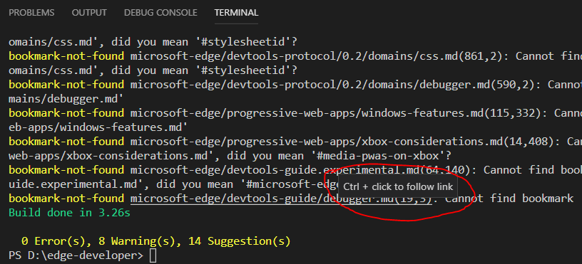
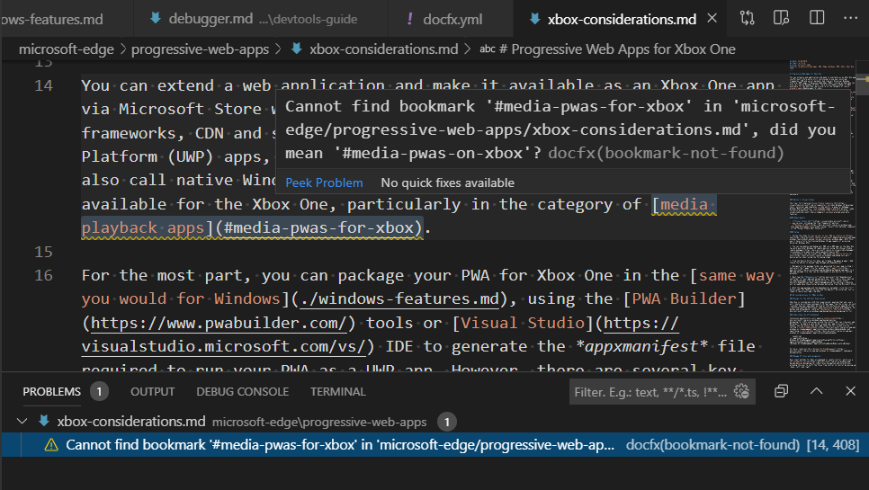
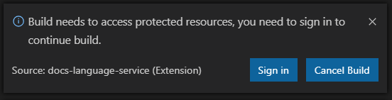
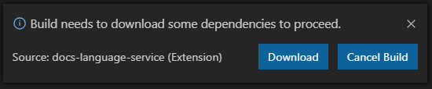
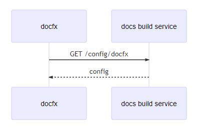
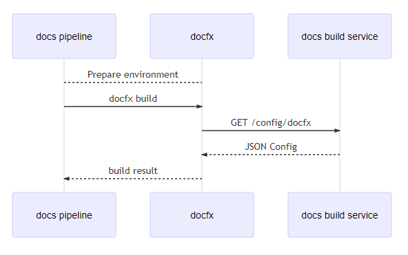
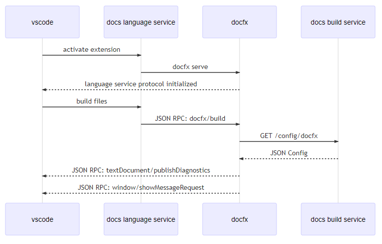
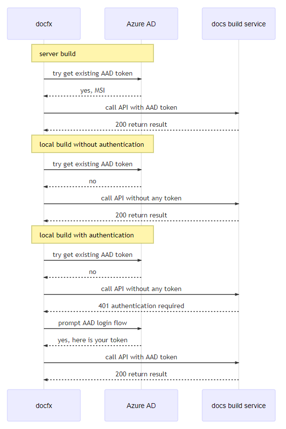

# Local build

Local build allows users to build against a locally stored [MicrosoftDocs](https://github.com/MicrosoftDocs) repository.

## Scope

- Provide a tool that runs on both Windows and MacOS
- The installation of the tool should be isolated and simple
- Build against all branches in a local repository
- Build output contains errors, warnings, suggestions with deep links to local files
- Ability to build all files and only changed files
- If the build require access to protected resources, authenticate the user using Azure Active Directory
- Build result should be the same as server build, except where it doesn't make sense (E.g., resolving GitHub contributors locally would exhaust users GitHub rate limit).

## User Experience

The initial MVP project can be a command line tool that satisfies the above requirements, the final product is an vscode extension that provides a seamless authoring experience in vscode.

### Phase 1: Command Line Tool

- Install latest [.NET Core SDK](https://dotnet.microsoft.com/download)
- Install docfx using `dotnet tool install -g docfx --version "3.0.0-*" --add-source https://www.myget.org/F/docfx-v3/api/v2`
- Open a [MicrosoftDocs](https://github.com/MicrosoftDocs) repository in vscode
- Open vscode integrated terminal
- Run `docfx build` to build all files
- Run `docfx build --changed` to build only changed files
  > Due to techinical limitations, we currently does not have a way to reliably detect potential impact of a change.
  > When you run `docfx build --changed`, we can only build changed content files (markdowns, TOCs, schema documents files),
  > changing a token or config does not trigger build, in this case use `docfx build` instead.

- If authentication is required, users are guided to sign in using the standard [Azure AD device login flow](https://docs.microsoft.com/en-us/azure/active-directory/develop/v2-oauth2-device-code).
  > The command line pauses and shows: _To sign in, use a web browser to open the page https://aka.ms/devicelogin and enter the code XXXX to authenticate._
- Errors, warnings, suggestions will show up in command line output with `ctrl` clickable links to source location


### Phase 2: vscode Integration

- Install the offical [Docs Authoring Pack](https://marketplace.visualstudio.com/items?itemName=docsmsft.docs-authoring-pack), local build extension is bundled as part of it.
- In vscode command palette, choose `Docs: Build All Files` to build everything, choose `Docs: Build Changed Files` to build only files that are changed

  
- Errors, warnings, suggestions will show up as standard errors in vscode `Problems Window` as well as squiggles in files.

  
- If authentication is required, users are prompted to sign in using standard Azure AD login flow.

  
- Build may need to download some external dependencies for the first time or occationally afterwards, users are prompted and build will then automatically download these dependcencies.

  

## Technical Design

### Components

name | description
-----|--------
docfx | Docs build engine https://github.com/dotnet/docfx
docs pipeline | The CI pipeline to build and publish content to https://docs.microsoft.com
docs build service | An internal REST service exposes build related functionalities
docs language service | A vscode extension that provides diagnostics, intellisense and refactoring to docs content

#### Local Command Line Build
`docfx` is the entry point to build a repository locally, it calls `docs build service` to retrieve docset specific configuration.



[Link to Graph](https://mermaidjs.github.io/mermaid-live-editor/#/view/eyJjb2RlIjoic2VxdWVuY2VEaWFncmFtXG4gICAgZG9jZnggLT4-IGRvY3MgYnVpbGQgc2VydmljZTogR0VUIC9jb25maWcvZG9jZnhcbiAgICBkb2NzIGJ1aWxkIHNlcnZpY2UgLS0-PiBkb2NmeDogSlNPTiBDb25maWdcblxuXG4iLCJtZXJtYWlkIjp7InRoZW1lIjoiZGVmYXVsdCJ9fQ)

#### Server Command Line Build

Server build uses the exact same way as local command line build, the only exceptions are:
- Server build runs `docfx` as a service account while locale build runs `docfx` as your personal Microsoft account.
- Server build may sets some server specific environment variables.



[Link to Graph](https://mermaidjs.github.io/mermaid-live-editor/#/view/eyJjb2RlIjoic2VxdWVuY2VEaWFncmFtXG4gICAgZG9jcyBwaXBlbGluZS0tPiBkb2NmeDogUHJlcGFyZSBlbnZpcm9ubWVudFxuICAgIGRvY3MgcGlwZWxpbmUtPj4gZG9jZng6IGRvY2Z4IGJ1aWxkXG4gICAgZG9jZnggLT4-IGRvY3MgYnVpbGQgc2VydmljZTogR0VUIC9jb25maWcvZG9jZnhcbiAgICBkb2NzIGJ1aWxkIHNlcnZpY2UgLS0-PiBkb2NmeDogSlNPTiBDb25maWdcbiAgICBkb2NmeCAtLT4-IGRvY3MgcGlwZWxpbmU6IGJ1aWxkIHJlc3VsdFxuXG5cbiIsIm1lcm1haWQiOnsidGhlbWUiOiJkZWZhdWx0In19)

#### Local vscode Build

Local vscode integration is build on top of [LSP (Language Server Protocol)](https://langserver.org/):

> The Language Server protocol is used between a tool (the client) and a language smartness provider (the server) to integrate features like auto complete, go to definition, find all references and alike into the tool

With LSP, we can expose all the smartness of docfx build engine to any tool, be it vscode, atom or an online web based editor. It is the de-facto standard to interact with a text editor.



[Link to Graph](https://mermaidjs.github.io/mermaid-live-editor/#/view/eyJjb2RlIjoic2VxdWVuY2VEaWFncmFtXG4gICAgdnNjb2RlIC0-PiBkb2NzIGxhbmd1YWdlIHNlcnZpY2U6IGFjdGl2YXRlIGV4dGVuc2lvblxuICAgIGRvY3MgbGFuZ3VhZ2Ugc2VydmljZSAtPj4gZG9jZng6IGRvY2Z4IHNlcnZlXG4gICAgZG9jZnggLS0-PiB2c2NvZGU6IGxhbmd1YWdlIHNlcnZpY2UgcHJvdG9jb2wgaW5pdGlhbGl6ZWRcbiAgICB2c2NvZGUgLT4-IGRvY3MgbGFuZ3VhZ2Ugc2VydmljZTogYnVpbGQgZmlsZXNcbiAgICBkb2NzIGxhbmd1YWdlIHNlcnZpY2UgLT4-IGRvY2Z4OiBKU09OIFJQQzogZG9jZngvYnVpbGRcbiAgICBkb2NmeCAtPj4gZG9jcyBidWlsZCBzZXJ2aWNlOiBHRVQgL2NvbmZpZy9kb2NmeFxuICAgIGRvY3MgYnVpbGQgc2VydmljZSAtLT4-IGRvY2Z4OiBKU09OIENvbmZpZ1xuICAgIGRvY2Z4IC0tPj4gdnNjb2RlOiBKU09OIFJQQzogdGV4dERvY3VtZW50L3B1Ymxpc2hEaWFnbm9zdGljc1xuICAgIGRvY2Z4IC0tPj4gdnNjb2RlOiBKU09OIFJQQzogd2luZG93L3Nob3dNZXNzYWdlUmVxdWVzdFxuXG5cbiIsIm1lcm1haWQiOnsidGhlbWUiOiJkZWZhdWx0In19)

### Config

#### OPS Config

`docfx` currently does not understand `.openpublishing.config.json` and `docfx.json`. There is a seperate config migration step that converts these config files and some server only configs to `docfx.yml` that docfx recognizes during server build. 

For local build, `docfx` needs to recognize these config files by embedding config migration into docfx.

#### Config Service

Some config values are protected resources, they __MUST__ be gated behind an authenticated service. `docs build service` exposes a `/config/docfx` endpoint to retrieve these protected resources:


url | url query parameters | allow public access | remarks
----|----|---|---
`/monikerdefinition` | | ❌ | Returns a JSON that confirms to docfx `monikerDefiniton` config 
`/metadataschema` | repository, branch | ✔ | Returns metadata JSON schema converted from metadata validation service. OPS metadata schema is bundled inside docfx.
`/xref/{basepath}` | exclude, branch, hostname | ✔ for public xrefmap. ❌ for private xrefmap | __TBD__ . _exclude_ represents docset name to exclude. when _branch_ missing, implies public xrefmap. When _hostname_ missing, implies _docs.microsoft.com_.

#### Config Service Authentication

Config service uses Azure AD for authentication. Thus `docfx` needs to implement a new AAD based authentication schema in addition to existing [HTTP header authentication](credential.md):

```yml
http:
  https://docs.microsoft.com:
    microsoftIdentity:
      enabled: {true|false} # required, default to false
      clientId: {clientId} # optional, default to docfx app
      tenant: {tenant} # optional, default to Microsoft tenant
```

When a host enables Microsoft Identity, all requests to that host tries to use existing AAD token first. When the server returns 401, client should re-authenticate against AAD and retry the request. 
>[Polly Retry](https://github.com/App-vNext/Polly) provides a handy method to retry on unauthorized access.



[Link to graph](https://mermaidjs.github.io/mermaid-live-editor/#/view/eyJjb2RlIjoic2VxdWVuY2VEaWFncmFtXG4gICAgbm90ZSBvdmVyIGRvY2Z4LCBBenVyZSBBRDogc2VydmVyIGJ1aWxkXG4gICAgZG9jZnggLT4-IEF6dXJlIEFEOiB0cnkgZ2V0IGV4aXN0aW5nIEFBRCB0b2tlblxuICAgIEF6dXJlIEFEIC0tPj4gZG9jZng6IHllcywgTVNJXG4gICAgZG9jZnggLT4-IGRvY3MgYnVpbGQgc2VydmljZTogY2FsbCBBUEkgd2l0aCBBQUQgdG9rZW5cbiAgICBkb2NzIGJ1aWxkIHNlcnZpY2UgLS0-PiBkb2NmeDogMjAwIHJldHVybiByZXN1bHRcblxuICAgIG5vdGUgb3ZlciBkb2NmeCwgQXp1cmUgQUQ6IGxvY2FsIGJ1aWxkIHdpdGhvdXQgYXV0aGVudGljYXRpb25cbiAgICBkb2NmeCAtPj4gQXp1cmUgQUQ6IHRyeSBnZXQgZXhpc3RpbmcgQUFEIHRva2VuXG4gICAgQXp1cmUgQUQgLS0-PiBkb2NmeDogbm9cbiAgICBkb2NmeCAtPj4gZG9jcyBidWlsZCBzZXJ2aWNlOiBjYWxsIEFQSSB3aXRob3V0IGFueSB0b2tlblxuICAgIGRvY3MgYnVpbGQgc2VydmljZSAtLT4-IGRvY2Z4OiAyMDAgcmV0dXJuIHJlc3VsdFxuXG4gICAgbm90ZSBvdmVyIGRvY2Z4LCBBenVyZSBBRDogbG9jYWwgYnVpbGQgd2l0aCBhdXRoZW50aWNhdGlvblxuICAgIGRvY2Z4IC0-PiBBenVyZSBBRDogdHJ5IGdldCBleGlzdGluZyBBQUQgdG9rZW5cbiAgICBBenVyZSBBRCAtLT4-IGRvY2Z4OiBub1xuICAgIGRvY2Z4IC0-PiBkb2NzIGJ1aWxkIHNlcnZpY2U6IGNhbGwgQVBJIHdpdGhvdXQgYW55IHRva2VuXG4gICAgZG9jcyBidWlsZCBzZXJ2aWNlIC0tPj4gZG9jZng6IDQwMSBhdXRoZW50aWNhdGlvbiByZXF1aXJlZFxuICAgIGRvY2Z4IC0-PiBBenVyZSBBRDogcHJvbXB0IEFBRCBsb2dpbiBmbG93XG4gICAgQXp1cmUgQUQgLS0-PiBkb2NmeDogeWVzLCBoZXJlIGlzIHlvdXIgdG9rZW5cbiAgICBkb2NmeCAtPj4gZG9jcyBidWlsZCBzZXJ2aWNlOiBjYWxsIEFQSSB3aXRoIEFBRCB0b2tlblxuICAgIGRvY3MgYnVpbGQgc2VydmljZSAtLT4-IGRvY2Z4OiAyMDAgcmV0dXJuIHJlc3VsdFxuIiwibWVybWFpZCI6eyJ0aGVtZSI6ImRlZmF1bHQifX0)


### Language Server

LSP uses [JSON RPC](https://www.jsonrpc.org/specification), a simple, light-weight JSON based remote procedure call protocol as the base protocol. To integrate LSP with vscode, language servers are lauched as a seperate process and communicate with vscode using standard input and standard output streams.

`docfx serve` command launches `docfx` as a local web server. When `--language-server` option is specified, it also launches the language server.

> The reason to use `docfx serve --language-server` as the command over `docfx watch` is that watching file changes is done in language clients (vscode) for [good reasons](https://microsoft.github.io/language-server-protocol/specification#workspace_didChangeWatchedFiles). If there is need to watch file system changes without a language client (vscode), we can choose to add a `--watch` flag to `docfx serve` that enables file system watching.
