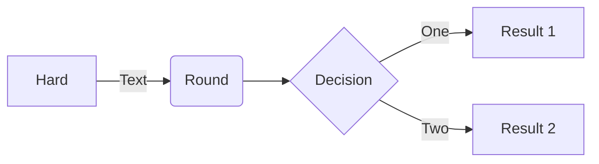
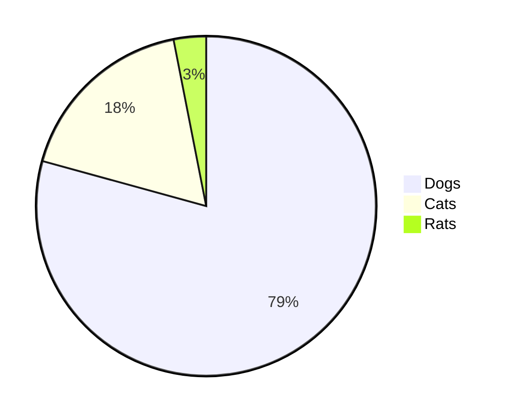
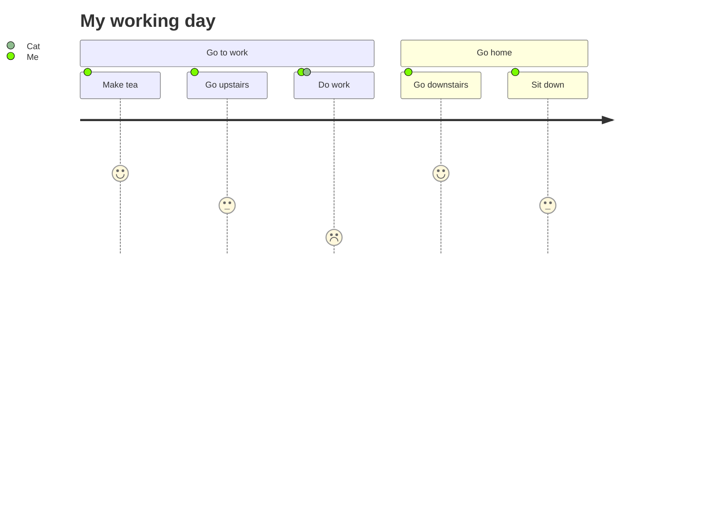
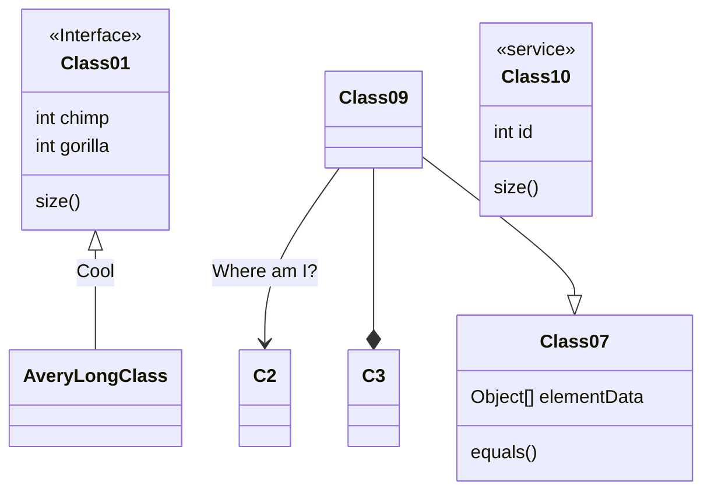

# Markdown

[Markdown](https://daringfireball.net/projects/markdown/) is a lightweight markup language with plain text formatting syntax. Docfx supports [CommonMark](https://commonmark.org/) compliant Markdown parsed through the [Markdig](https://github.com/xoofx/markdig) parsing engine.

## Markdown Extensions

Docfx supports additional markdown syntax that provide richer content. These syntax are specific to docfx and won't be rendered elsewhere like GitHub.  In addition to its own extensions, docfx also supports the use of the markdown extensions provided by [Markdig](https://github.com/xoofx/markdig?tab=readme-ov-file#features).

The following list of Markdig extensions are enabled by default for docfx:
- [Mathematics](https://github.com/xoofx/markdig/blob/master/src/Markdig.Tests/Specs/MathSpecs.md)
- [Emphasis Extras](https://github.com/xoofx/markdig/blob/master/src/Markdig.Tests/Specs/EmphasisExtraSpecs.md)
- [Auto Identifiers](https://github.com/xoofx/markdig/blob/master/src/Markdig.Tests/Specs/AutoIdentifierSpecs.md)
- [Media Links](https://github.com/xoofx/markdig/blob/master/src/Markdig.Tests/Specs/MediaSpecs.md)
- [Pipe Tables](https://github.com/xoofx/markdig/blob/master/src/Markdig.Tests/Specs/PipeTableSpecs.md)
- [Auto Links](https://github.com/xoofx/markdig/blob/master/src/Markdig.Tests/Specs/AutoLinks.md)
- [Emoji](https://github.com/xoofx/markdig/blob/master/src/Markdig.Tests/Specs/EmojiSpecs.md)

To use other custom markdown extensions:

1. Use docfx as a NuGet library:

```xml
<PackageReference Include="Docfx.App" Version="2.70.0" />
```

2. Configure the markdig markdown pipeline:

```cs
var options = new BuildOptions
{
    // Enable custom markdown extensions here
    ConfigureMarkdig = pipeline => pipeline.UseAbbreviations().UseFootnotes(),
}

await Docset.Build("docfx.json", options);
```

Alternatively, set the `build.markdownEngineProperties.markdigExtensions` property in `docfx.json` to the list of additional extensions to use:

```json
{
  "build": {
    "markdownEngineProperties": {
      "markdigExtensions": [
          "Abbreviations",
          "Footnotes"
      ]
    }
  }
}
```

The known extension names are listed in [MardownExtensions.Configure](https://github.com/xoofx/markdig/blob/master/src/Markdig/MarkdownExtensions.cs) method in the MarkDig project.

> [!Note]
> The custom configuration of extensions via the `build.markdownEngineProperties.markdigExtensions` property is not supported.

## YAML header

Also referred to as YAML Front Matter, the YAML header is used to annotate a Markdown file with various metadata elements.  It should appear at the top of the document.  Here's an example:

```markdown
---
uid: fileA
---

# This is fileA
...
```
In this example, the UID provides a unique identifier for the file and is intended to be unique inside a project. If you define duplicate UID for two files, the resolve result is undetermined.

For API reference files, the UID is auto generated by mangling the API's signature. For example, the System.String class's UID is `System.String`. You can open a generated YAML file to lookup the value of its UID.

> [!Note]
> Conceptual Markdown file doesn't have UID generated by default. So it cannot be cross referenced unless you give it a UID.

See the list of [predefined metadata](../reference/docfx-json-reference.md#predefined-metadata) for applicable options for inclusion in the YAML header.

## Alerts

Alerts are block quotes that render with colors and icons that indicate the significance of the content.

The following alert types are supported:

```markdown
> [!NOTE]
> Information the user should notice even if skimming.

> [!TIP]
> Optional information to help a user be more successful.

> [!IMPORTANT]
> Essential information required for user success.

> [!CAUTION]
> Negative potential consequences of an action.

> [!WARNING]
> Dangerous certain consequences of an action.
```

They look like this in rendered page:

> [!NOTE]
> Information the user should notice even if skimming.

> [!TIP]
> Optional information to help a user be more successful.

> [!IMPORTANT]
> Essential information required for user success.

> [!CAUTION]
> Negative potential consequences of an action.

> [!WARNING]
> Dangerous certain consequences of an action.

### Custom Alerts

You can define custom alerts with the `build.markdownEngineProperties.alerts` property in `docfx.json` and use it in markdown files. The key specifies the markdown keyword without the surrounding `[!`, `]` symbols. The value is the CSS class names:

```json
{
  "build": {
    "markdownEngineProperties": {
      "alerts": {
        "TODO": "alert alert-secondary"
      }
    }
  }
}
```

```md
> [!TODO]
> This is a custom TODO section
```

The above custom alert looks like this in rendered page:

> [!TODO]
> This is a custom TODO section

DocFX allows you to customize the display of alert titles in your documentation. By default, alert titles are displayed as the keyword in upper case. To change this behavior, you can create a custom template and use a `token.json` file to define your custom alert titles:

1. **Create a custom template**: Follow the steps in the [Custom Template Guide]([create a custom template](./template.md#custom-template)) to create your own template.
2. **Create a `token.json` file**: In your custom template folder, create a new file named `token.json`. This file will be used to define your custom alert titles. The format should be as follows:

  ```md
  {
    "todo": "MY TODO"
  }
  ```

  In this example, the key is the alert keyword in **lower case** (e.g., "todo"), and the value is the custom display title of the alert (e.g., "MY TODO").

## Video

You can embed a video in your page by using the following Markdown syntax:

```md
> [!Video embed_link]
```

Example:
```md
> [!Video https://www.youtube.com/embed/Sz1lCeedcPI]
```

This will be rendered as:

> [!Video https://www.youtube.com/embed/Sz1lCeedcPI]

## Image

You can embed a image in your page by using the following Markdown syntax:

```md

```

Example:
```md

```

This will be rendered as:


## Math Expressions

Docfx supports [LaTeX formatted math expressions](https://en.wikibooks.org/wiki/LaTeX/Mathematics) within markdown using [MathJax](https://docs.mathjax.org/en/latest/#).

> [!NOTE]
> Math expressions is only supported in the `modern` template.

To include a math expression inline with your text, delimit the expression with a dollar symbol $.

```md
This sentence uses `$` delimiters to show math inline:  $\sqrt{3x-1}+(1+x)^2$
```

This sentence uses `$` delimiters to show math inline:  $\sqrt{3x-1}+(1+x)^2$

To add a math expression as a block, start a new line and delimit the expression with two dollar symbols $$.

```md
**The Cauchy-Schwarz Inequality**

$$\left( \sum_{k=1}^n a_k b_k \right)^2 \leq \left( \sum_{k=1}^n a_k^2 \right) \left( \sum_{k=1}^n b_k^2 \right)$$
```

**The Cauchy-Schwarz Inequality**

$$\left( \sum_{k=1}^n a_k b_k \right)^2 \leq \left( \sum_{k=1}^n a_k^2 \right) \left( \sum_{k=1}^n b_k^2 \right)$$

## Mermaid Diagrams

You can embed [mermaid](https://mermaid.js.org/) diagrams using markdown code block:

Example:

    ```mermaid
    flowchart LR

    A[Hard] -->|Text| B(Round)
    B --> C{Decision}
    C -->|One| D[Result 1]
    C -->|Two| E[Result 2]
    ```

This will be rendered as:



> [!NOTE]
> Mermaid diagrams is only supported in the `modern` template.

There are plenty of other diagrams supported by mermaid such as:

Pie chart



Bar chart

```mermaid
gantt
    title Git Issues - days since last update
    dateFormat  X
    axisFormat %s

    section Issue19062
    71   : 0, 71
    section Issue19401
    36   : 0, 36
    section Issue193
    34   : 0, 34
    section Issue7441
    9    : 0, 9
    section Issue1300
    5    : 0, 5
```



User Journey diagram



Class diagram



## PlantUML Diagrams

You can embed [PlantUML](https://plantuml.com/) diagrams using markdown code blocks:

Example:

    ```plantuml
    Bob -> Alice : hello
    ```

This will be rendered as:


There are plenty of other diagrams supported by PlantUML such as:

* [Sequence diagram](http://plantuml.com/sequence-diagram)
* [Use Case diagram](http://plantuml.com/use-case-diagram)
* [Class diagram](http://plantuml.com/activity-diagram-beta)
* [Activity diagram](http://plantuml.com/activity-diagram-beta)
* [Component diagram](http://plantuml.com/component-diagram)
* [State diagram](http://plantuml.com/state-diagram)
* [Gantt diagram](https://plantuml.com/gantt-diagram)
* [Deployment diagram](http://plantuml.com/deployment-diagram)
* [Mindmap diagram](https://plantuml.com/mindmap-diagram)

Refer to the [PlantUml reference guide](http://plantuml.com/PlantUML_Language_Reference_Guide.pdf) for more details.

### Settings

The PlantUML extension can be configured using the `build.markdownEngineProperties.plantUml` property of your `docfx.json` file:

```json
{
  "build": {
    "markdownEngineProperties": {
      "plantUml": {
          "outputFormat": "svg",
          "remoteUrl": "http://www.plantuml.com/plantuml/",
          "renderingMode": "remote"
      }
    }
  }
}
```

The following settings are available for configuration:

| Setting | Description | Default |
| ------- | ----------- | ---------|
| `javaPath`              | path to java installation                                               | uses the JAVA_HOME environment variable |
| `localGraphvizDotPath`  | path to graphviz dot exe (required for local rendering mode only)       | none                                    |
| `localPlantUmlPath`     | path to plantuml.jar                                                    | will look in project directory          |
| `outputFormat`          | format of generated images (svg, ascii, ascii_unicode)                  | svg                                     |
| `remoteUrl`             | url to remote PlantUml server (required for remote rendering mode only) | http://www.plantuml.com/plantuml/       |
| `renderingMode`         | remote or local                                                         | remote

### Local Rendering

By default, PlantUML diagrams will be rendered on the remote server. Local rendering mode uses a [local copy](https://plantuml.com/faq-install) of PlantUML to render diagrams.  Local rendering mode can be configured in your `docfx.json` file:

```json
{
  "build": {
    "markdownEngineProperties": {
      "plantUml": {
          "localPlantUmlPath": "path/to/plantuml.jar",
          "renderingMode": "local"
      }
    }
  }
}
```

> [!NOTE]
> GraphViz Dot is required for local rendering mode of any diagram other than sequence. Refer to the [PlantUML documentation](http://plantuml.com/graphviz-dot) for more detailed instructions.

## Include Markdown Files

Where markdown files need to be repeated in multiple articles, you can use an include file. The includes feature replace the reference with the contents of the included file at build time.

You can reuse a common text snippet within a sentence using inline include:

```markdown
Text before [!INCLUDE [<title>](<filepath>)] and after.
```

Or reuse an entire Markdown file as a block, nested within a section of an article. Block include is on its own line:

```markdown
[!INCLUDE [<title>](<filepath>)]
```

Where `<title>` is the name of the file and `<filepath>` is the relative path to the file.

Example:
```markdown
[!INCLUDE [my-markdown-block](../../includes/my-markdown-block.md)]
```

Included markdown files needs to be excluded from build, they are usually placed in the `/includes` folder.

## Code Snippet

There are several ways to include code in an article. The code snippet syntax replaces code from another file:

```markdown
[!code-csharp[](Program.cs)]
```

You can include selected lines from the code snippet using region or line range syntax:

```markdown
[!code-csharp[](Program.cs#region)]
[!code-csharp[](Program.cs#L12-L16)]
```

Code snippets are indicated by using a specific link syntax described as follows:

```markdown
[!code-<language>[](<filepath><query-options>)]
```

Where `<language>` is the syntax highlighting language of the code and `<filepath>` is the relative path to the markdown file.

### Highlight Selected Lines

Code Snippets typically include more code than necessary in order to provide context. It helps readability when you highlight the key lines that you're focusing on. To highlight key lines, use the `highlight` query options:

```markdown
[!code-csharp[](Program.cs?highlight=2,5-7,9-)]
```

The example highlights lines 2, line 5 to 7 and lines 9 to the end of the file.

[!code-csharp[](media/Program.cs?highlight=2,5-7,9-)]

## Tabs

Tabs enable content that is multi-faceted. They allow sections of a document to contain variant content renderings and eliminates duplicate content.

Here's an example of the tab experience:

# [Linux](#tab/linux)

Content for Linux...

# [Windows](#tab/windows)

Content for Windows...

---

The above tab group was created with the following syntax:

```markdown
# [Linux](#tab/linux)

Content for Linux...

# [Windows](#tab/windows)

Content for Windows...

---
```

Tabs are indicated by using a specific link syntax within a Markdown header. The syntax can be described as follows:

```markdown
# [Tab Display Name](#tab/tab-id)
```

A tab starts with a Markdown header, `#`, and is followed by a Markdown link `[]()`. The text of the link will become the text of the tab header, displayed to the customer. In order for the header to be recognized as a tab, the link itself must start with `#tab/` and be followed by an ID representing the content of the tab. The ID is used to sync all same-ID tabs across the page. Using the above example, when a user selects a tab with the link `#tab/windows`, all tabs with the link `#tab/windows` on the page will be selected.

### Dependent tabs

It's possible to make the selection in one set of tabs dependent on the selection in another set of tabs. Here's an example of that in action:

# [.NET](#tab/dotnet/linux)

.NET content for Linux...

# [.NET](#tab/dotnet/windows)

.NET content for Windows...

# [TypeScript](#tab/typescript/linux)

TypeScript content for Linux...

# [TypeScript](#tab/typescript/windows)

TypeScript content for Windows...

# [REST API](#tab/rest)

REST API content, independent of platform...

---

Notice how changing the Linux/Windows selection above changes the content in the .NET and TypeScript tabs. This is because the tab group defines two versions for each .NET and TypeScript, where the Windows/Linux selection above determines which version is shown for .NET/TypeScript. Here's the markup that shows how this is done:

```markdown
# [.NET](#tab/dotnet/linux)

.NET content for Linux...

# [.NET](#tab/dotnet/windows)

.NET content for Windows...

# [TypeScript](#tab/typescript/linux)

TypeScript content for Linux...

# [TypeScript](#tab/typescript/windows)

TypeScript content for Windows...

# [REST API](#tab/rest)

REST API content, independent of platform...

---
```

## Differences introduced by DFM syntax

> [!Warning]
> Please note that DFM introduces more syntax to support more functionalities. When GFM does not support them, preview the
> Markdown file inside *GFM Preview* can lead to different results.

### Text after block extension

Some block extension in DFM cannot be recognized in GFM.
In GFM, it would be treated as a part of paragraph.
Then, following content would be treated as a part of paragraph.

For example:
```md
> [!NOTE]
>     This is code.
```

In GFM, it will be rendered as a paragraph with content `[!NOTE] This is code.` in blockquote.
In DFM, it will be rendered as a code in note.
