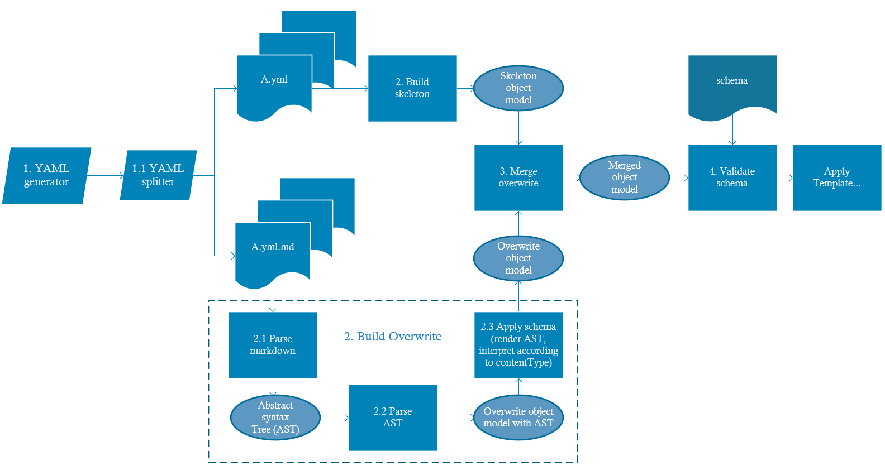

# Overwrite Document V3 - Markdown Fragments

## 1 Overview

DocFX v2 already supports overwrite document. It allows user to add or modify some properties in YAML files, without losing changes if the YAML files are generated later again. Here is the spec for v2: http://dotnet.github.io/docfx/tutorial/intro_overwrite_files.html

There are some points that can be improved with the current overwrite model:

1. It is hard to tell which property will be marked up in YAML section.
2. It is hard to find the UID to overwrite when creating an overwrite file.
3. The need of easy preview on GitHub site with a single markdown file.

The new overwrite document design aims to address these issues.

## 2 Overwrite Markdown File Format

First, we introduce a new overwrite markdown format - *Markdown Fragments*. Here is a sample of markdown fragments:

````markdown
# `System.String`
``` yaml
author: rpetrusha
ms.author: ronpet
manager: wpickett
```
## `summary`
Represents text as a sequence of UTF-16 code units.

## `remarks`
A string is a sequential collection of characters that is used to represent text.

### Instantiating a String object

## `return/description`
Markdown content
## `parameters[id="parameterName"]/description`
Markdown content

# `System.String.#ctor(System.Char*)`
``` yaml
metaKey: metaValue for UID System.String.#ctor(System.Char*)
```

## `summary`
...

````

Markdown fragments looks like a normal markdown file. The boundary between markdown content and normal content is clearer. All values inside YAML section are normal value, while other content is markdown content. A new contributor can easily find the part to modify.

Before, all the information is in a single YAML files. Under this new overwrite markdown design, it is required to split information of a single page into 2 files: one for non-markdown fields, which we name as **skeleton YAML**, and one for all markdown fields, named as **overwrite markdown**.

> [!WARNING]
>
> In overwrite markdown's YAML section, a property will also be marked up if it is of `markdown` [contentType](http://dotnet.github.io/docfx/spec/docfx_document_schema.html#63-contenttype).

If there is already a skeleton YAML as below:
``` yaml
uid: System.String
parameters:
- id: parameterName
children:
- uid: System.String.#ctor(System.Char*)
```

After merge it with the sample markdown fragments, the merged model is:
``` yaml
uid: System.String
author: rpetrusha
ms.author: ronpet
manager: wpickett
summary: <p>Represents text as a sequence of UTF-16 code units.</p>
remarks: |
  <p>
    A string is a sequential collection of characters that is used to represent text.
  </p>
  <h3>
    Instantiating a String object
  </h3>
return:
  description: <p>Markdown content</p>
parameters:
- id: parameterName
  description: <p>Markdown content</p>
children:
- uid: System.String.#ctor(System.Char*)
  metaKey: metaValue for UID System.String.#ctor(System.Char*)
```

### 2.1 Overview

This sample contains 2 **Overwrite Sections**, to overwrite `System.String` and `System.String.#ctor(System.Char*)`. Each overwrite section is composed of:
* **L1 inline code heading**

  It specifies the UID to overwrite. Note that the space between `#` and incline code is mandatory in CommonMark.

  If UID already contains back-tick `` ` ``, two back-ticks ` `` ` can be used to wrap an inline code.

* **YAML code block**

  It can add additional properties to the specified UID.

  It must be a valid YAML set between three back-ticks ` ``` `. The language of code block is optional. However, if it is set, it should be `yaml` or `yml`. Otherwise, a warning should be logged.

  It must lie between an L1 inline code heading and an L2 inline code heading.

* **L2 inline code heading**

  It indicates the property to overwrite within the UID specified in L1 heading by [OPath](#2-2-opath).

* **Markdown content**
  
  It is the value of the property specified in L2 heading. The content will be marked up.

### 2.2 OPath

OPath (Overwrite Path) is used in L2 inline code heading to specify which property to overwrite within a UID item. The syntax is borrowed from [XPath](https://www.w3.org/TR/1999/REC-xpath-19991116/), with limited syntax supported.

The primary purpose of XPath is to address parts of an XML document, so it is natural for XPath to return a list of matching nodes. However, the markdown fragments here also serves as partial document data source. OPath must accurately target a specific node at a specific position. Therefore, the OPath only preserve the strictest syntax in XPath.

All the syntax supported in OPath are listed below:

| Path Expression      | Description                 |
| ---------------------| ----------------------------|
| `node1/node11`       | Overwrite a property in an object |
| `parameters[id="para1"]/description` | Overwrite a property of an item in an array of object |

#### 2.2.1 Overwrite a property in an object

For object type, the OPath contains node names divided by slash `/`. If the path before the `/` targets a node and it has children, the name after slash means to get the *immediate* children of the node. For example, OPath `a/b/c` aims to overwrite `value`:

```yaml
title: sample
item:
  uid: aUid
  a:
    b:
      c: value
```

> [!NOTE]
>
> Note that the OPath starts from the same level as UID, so it is `a/b/c` here, not `item/a/b/c` from YAML root level.

#### 2.2.2 Overwrite a property of an item in an array of object

For array type, the OPath should also specify which object in the array to overwrite by a **predicate expression**. A predicate expression is an expression composed of left operator, `=`, and right operator:
* *Left operator* should be a property name with [merge type](http://dotnet.github.io/docfx/spec/docfx_document_schema.html#65-mergetype) `key`.

  As the new overwrite markdown format is planned to used only in [Schema-driven document processor(SDP)](http://dotnet.github.io/docfx/spec/sdp_design_spec.html), so it involves some concepts in SDP.
* *right operator* should be a JSON value of string type.

For example, `parameters[id="para1"]/description` aims to overwrite `value1`:

```yaml
uid: aUid
parameters:
- id: para1
  description: value1
- id: para2
  description: _another_ value
```

## 3 E2E overwrite pipeline design

The overall pipeline is updated as follows:



### 3.1 YAML generator

The YAML generators ls) will generate YAML files from source, then a shared YAML splitter will take over and split YAML files to skeleton + overwrite files. The overwrite files are required to contain all the markdown fields.
If users want to contribute to the document, they can modify the overwrite markdown files directly. It is easier and more straightforward, as users needn't fill in the UID manually.

The skeleton YAML and overwrite markdown is paired by naming convention. The file with file name that is appended `.md` to the skeleton YAML's filename is treated as it is overwrite markdown. For example, if a file named `a.yml` is generated, the file `a.yml.md` **at the same folder** is considered as the overwrite file of it. Users can change `a.yml.md` to modify a certain paragraph.

It is also supported to separate them into different folders.

As `.yaml` is also a valid extension for YAML file, the overwrite markdown of `b.yaml` should be named as `b.yaml.md`, not `b.yml.md`.
With this extension restriction, DocFX can easily distinguish overwrite document from normal markdown content, without need to update `docfx.json` with some exclusion rules.

#### 3.1.1 YAML splitter
We will have a shared YAML splitter to handle overwrite markdown syntax and incremental update logic, so that this complexity can be hidden for CI tools of different languages. CI tools only need to focus on producing correct YAML files.

### 3.2 Build overwrite document

The overwrite document is built into a list of overwrite object model, including which UID to overwrite, and what properties to overwrite.

#### 3.2.1 Parse markdown

Firstly, the markdown parser need to convert the markdown to abstract syntax tree (AST).

Other than a normal markdown, it should be rendered into HTML later, as some nodes just uses markdown format to express how to overwrite (like L1 inline code heading), not for directly HTML output.

#### 3.2.2 Parse AST

In this step, the AST need to be parsed to generate the overwrite object model. The following nodes in AST should be handled:
* **L1 inline code heading**

  Each L1 inline code heading correspond to an overwrite object model. Its value is used as uid's value.

* **YAML code block**

  This node is the only node allowed between L1 inline code heading and L2 inline code heading. A warning should be logged if other content is here.

  The content of the node should be YAML-deserialized, and filled into the corresponding uid's overwrite object model.

* **L2 inline code heading**

  This node should be parsed as an OPath, and then filled the value in the right place. A warning should be logged if the value is not a valid OPath.

* **Other nodes**
  
  All the nodes after an L2 inline code heading and before an L1/L2 inline code heading is considered as the markdown content. These nodes is filled into the property specified in L2 inline code heading.

  This part will always be marked up, even the property is not of `markdown` contentType in schema.

  > [!NOTE]
  >
  > Some nodes like reference-style link definitions should be expanded and inserted into each markdown content.

There isn't a specific step to validate the format of the overwrite markdown content. Some validations are done while parsing AST.

#### 3.2.3 Apply Schema

If a field has a contentType other than `default`, SDP need to interpret it. In this step, SDP is used to achieve this.

Now the overwrite object model still contains some AST for "real" markdown content. It should be rendered into HTML in this step, no matter whether its contentType is `markdown` or not.

### 3.3 Merge overwrite document

The overwrite object models is merged into the skeleton object model.

This step is similar as in DocFX v2.

### 3.4 Validate schema

Schema validation is performed after merging the partial YAML and MD.