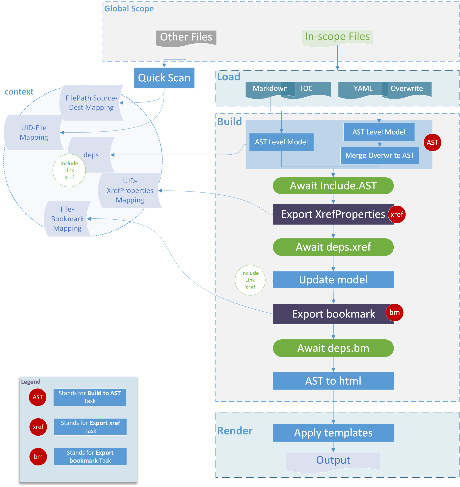
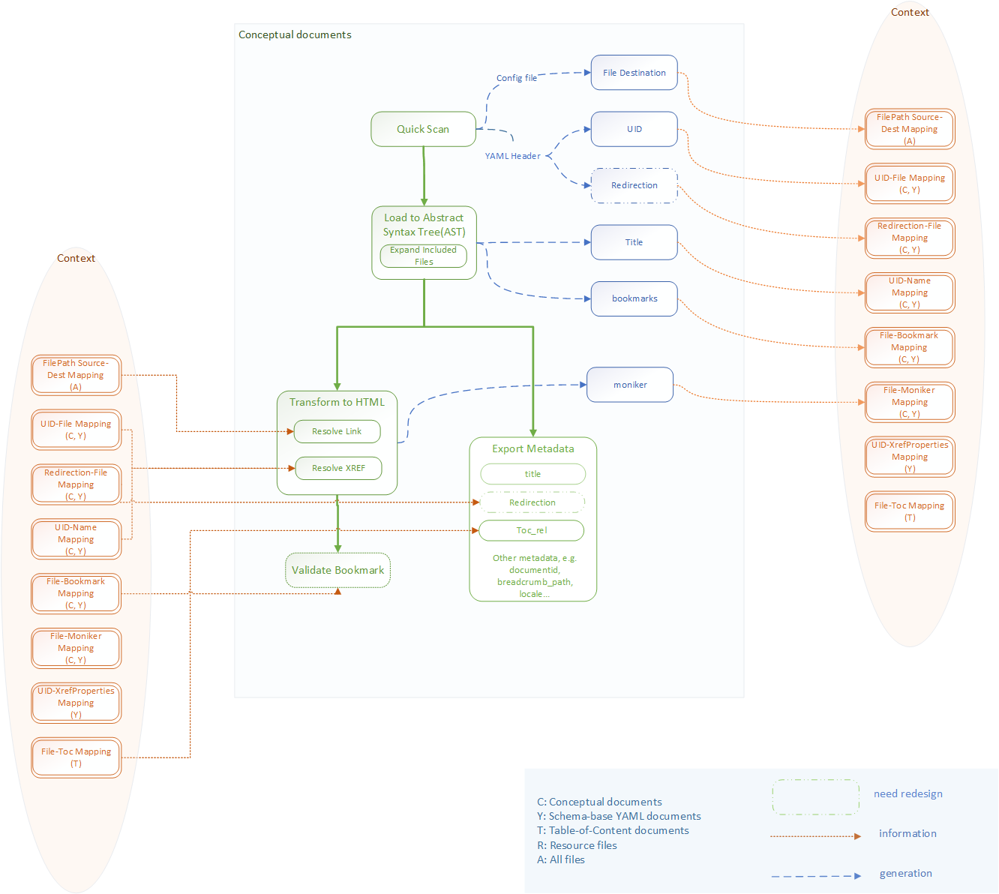
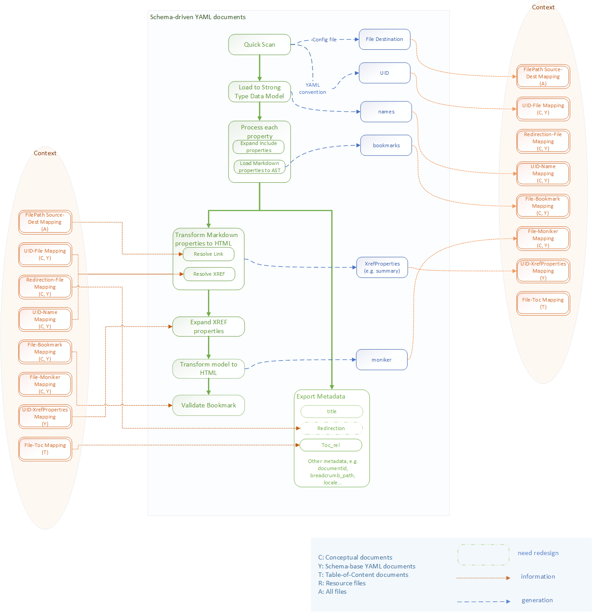
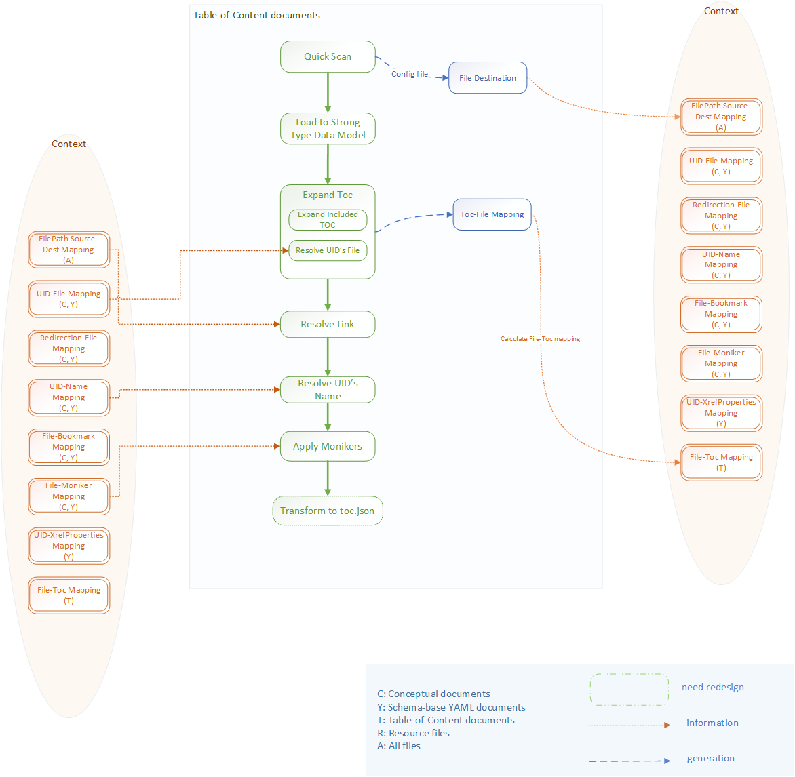

# DocFX v3

> [!NOTE]
> This documentation is still a work in progress.

> [!NOTE]
> We've started the implementation of DocFX v3!
> Check out the task board [here](https://github.com/dotnet/docfx/projects/1).

<h2 class="accented">Overview</h2>

Currently, DocFX is already the core of the build and publish pipeline that powers Docs site. However, we are still seeing various pain points when using, developing or troubleshooting this pipeline, namely with following outstanding issues:

1. The performance still needs improvement to make writers satisfied.
2. No easy local debug and test. Different results come from local build and server build.
3. DocFX extension model is too flexible that it is really hard to make changes in DocFX without impacting the plugins. The flexibility also hinders users to dig deep into the code and contribute.
4. It is hard to maintain configurations as they scatter in various places besides *docfx.json*.
5. Technical stacks are different causing additional overhead in development and troubleshooting.
6. Community users are expressing their desire for a tool that would generate a documentation site similar to Docs, but there is no easy way to approach them with the current design.

We'd like to address these pain points in v3 aiming to make v3 to be a world-class "docs" tool with following visions:

1. Provide markdown and all reference language documentation support.
2. Run anywhere and publish to anywhere possible.

<h2 class="accented">Design Principle</h2>

- **Fast**! Performance is always the key factor
- **Right** Design the system in the right way, not lower efforts. If it needs breaking changes, we should provide a way to migrate
- Create **tools** not libraries, we don't provide extensions everywhere, only provide plugable points if it is really needed
- **Test** driven, test should be reliable, fast, high coverage
- **Leverage** existing high quality components from our team or the ecosystem
- **Deterministic**, the output of each step should only determined by the input, not related to environment
- A component should focus on **one** aspect
- **Cross platform**
- Keep it **simple**, **ease of use**, don’t let developers and users make hard decisions
- Provide **one** single tool, do not separate the features for docs.microsoft.com features or community users
- The **same** pipeline for every programming language

<h2 class="accented">Scope</h2>

1. Build content
    - conceptual markdown
    - TOC
    - YML-format structured conceptual (landing page, contextual object)
    - YML-format reference documentation
    - [markdown fragment](markdown-fragments.md)
    - localization scenarios
2. Build source (a.k.a CI) for reference languages
    - .NET (embedded)
    - other languages (easily integrated)
3. Template/Theme
    - Razor-based template
    - Docs-like theme
4. Performance
    - Building Repo containing 2000 markdown files within 5 minutes
    - Building Repo containing 200,000 YAML files within 30 minutes
    - Building huge Repo can succeed
5. Usability
    - Local and server build
    - Watch
    - Cross-platform
    - Configuration
    - PDF
6. Engineering
    - Test
    - Debugging
    - Deployment

<h2 class="accented">Key Components</h2>

* Build (markdown)
* Build (TOC)
* Build (YML via SDP)
* Metadata
* CI
* Template (via Razor)
* Configuration

<h2 class="accented">Build</h2>

### Pipeline

The general build pipeline is illustrated in the following diagram.

 

Key points (and the main difference from v2) are:

1. <b>Starting from in-scope files</b>

Build pipeline runs in parallel on in-scope files. The initial in-scope list is determined based on different scenarios from a global scope defined in configuration.

  * Full build: All files in global scope are in-scope files.   
  * Incremental build: In-scope files are those changed or their direct or indirect dependent files.    
  * Watch: In-scope files are the ones rendered in local render.

2. <b>Scope is dynamic</b>

Build pipeline may discover dependencies of the file in various steps. The dependency files will then be added into the in-scope list, i.e. the in-scope list is dynamic.

3. <b>Finer granularity in build pipeline</b>

Build pipeline consists of various steps. Each step may report one or more dependencies. If necessary, build pipeline can stop right after it gets to produce a required dependency. For example, in order to get the title of a markdown for UID-Name Mapping, the build pipeline can stop once it produces the AST and extracts the title from the AST.

Steps can also require dependencies from other files. Once all required dependencies are available, the pipeline will be ready to resume. There is no explicit synchronization on build steps among different pipelines.

4. <b>Quick-scan stage and post-build stage</b>

A global context will be constructed to store and manage the dependencies. For certain dependency (for example, UID-File Mapping) that requires information from global scope, we may decide to put them into a quick-scan step executed before any build pipeline on a case-by-case basis.

Similarly, certain operations may be considered to better implemented as a post-build step on a case-by-case basis. For example, the generation of Git contribution information would be likely to put into the post-build stage.

### Dependency Graph

Based on current supported scenarios, we summarize the dependency graph of different files as in the following diagrams for different files respectively.

#### Conceptual

 

#### YML

 

#### TOC

 

<h2 class="accented">Integration with Template</h2>

### Summary

* Replace Mustache/Liquid/Jint with Razor
* Define a strongly typed contract between build and template

### Razor Template Engine

We desperately want to replace Mustache/Liquid/Jint with razor.

These are the two design principles we'd like to pursue while designing the new razor template engine:

1. Treat template engine as a simple process that transforms a model to text.

    This strictly defines the purpose and scope of a template engine. A few interesting scenarios light up when a template engine is just a simple process that takes a model and produces some text (`model -> text`):

    - Dynamic rendering and static rendering can, for the most part, use the same template engine and template, like today. The only difference is *When* templates are applied to a model: is it during build or during render?

    - The same template engine can be used to render PDF, offline books and potentially other output formats that are not a website.

2. Treat razor as code instead of resources

    Though liquid/mustache are treated as code in templates, it is treated more like resources in build and hosting: the hosting process loads an arbitrary liquid template from blob storage and execute agaist that template.
    
    Razor templates however essentially compiles down to C# and eventually an assembly, it is better for build and hosting to treat razor template as code instead of resources. This may affect how razor templates are deployed and integrated with build and hosting:
    
    - There is a compliation process that ideally runs during template deployment
    - Dynamic loading assemblies *may* lead to assembly versioning problems, so hosting *may* need to treat template as a code reference and redeploy on template changes.

### Strongly Typed Template Contract

When the template engine is switched to razor, it is essential to have a set of strongly typed contract in C# to be consumed by razor templates, for intellisence, compile time checks.

#### Strongly Typed SDP Schemas

Currently SDP schemas are written in JSON schema, they works for weakly typed scripting engines like Mustache/Jint, but to really take advantage of C# and razor, we need a set of schemas in C#.