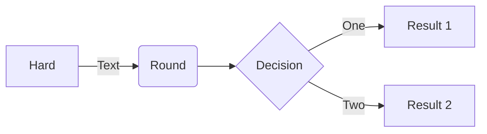
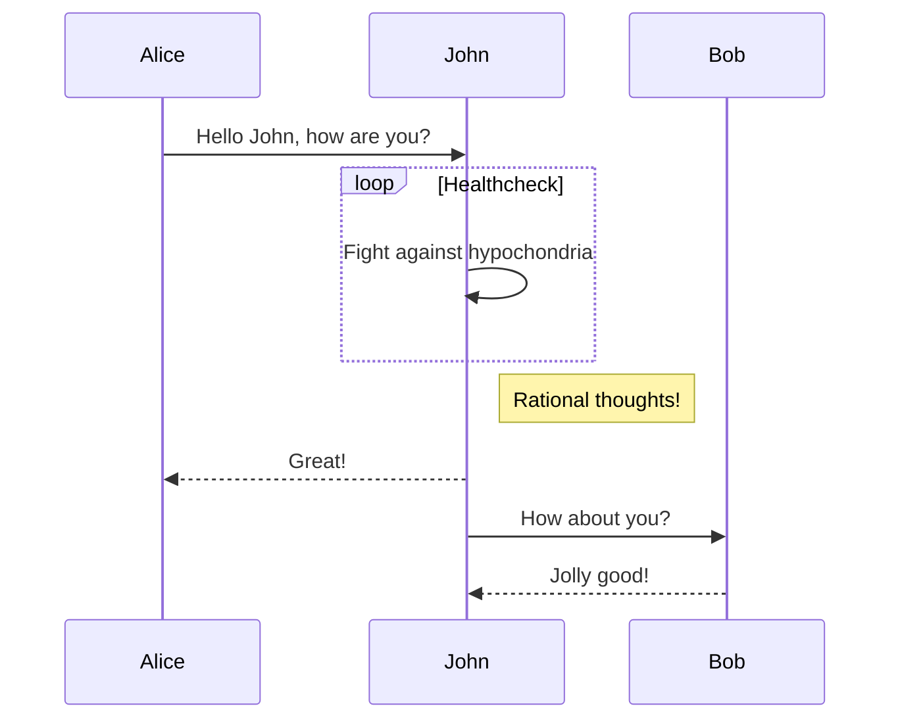
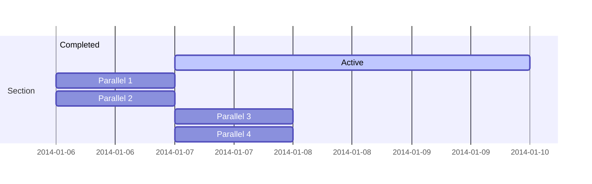
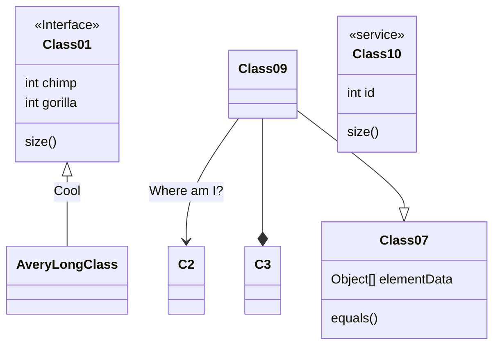
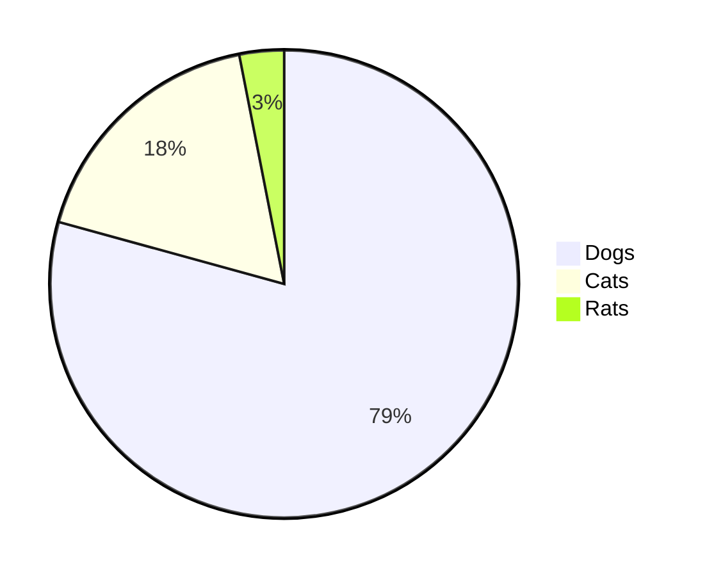
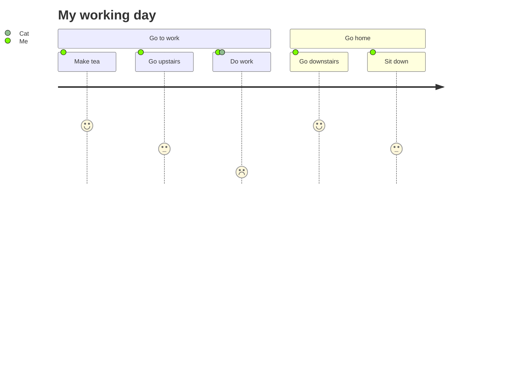
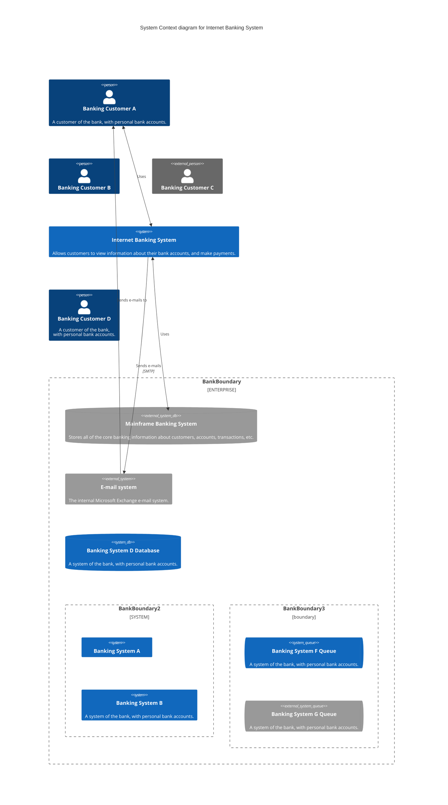

# Markdown

[Markdown](https://daringfireball.net/projects/markdown/) is a lightweight markup language with plain text formatting syntax. Docfx supports [CommonMark](https://commonmark.org/) compliant Markdown parsed through the [Markdig](https://github.com/xoofx/markdig) parsing engine.

## Markdown Extensions

Docfx supports additional markdown syntax that provide richer content. These syntax are specific to docfx and won't be rendered elsewhere like GitHub.

To use a custom markdown extension:

1. Use docfx as a NuGet library:

```xml
<PackageReference Include="Microsoft.DocAsCode.App" Version="2.61.0" />
```

2. Configure the markdig markdown pipeline:

```cs
var options = new BuildOptions
{
    // Enable custom markdown extensions here
    ConfigureMarkdig = pipeline => pipeline.UseCitations(),
}

await Docset.Build("docfx.json", options);
```

Here is a list of markdown extensions provided by docfx by default.

## Alerts

Alerts are block quotes that render with colors and icons that indicate the significance of the content.

The following alert types are supported:

```markdown
> [!NOTE]
> Information the user should notice even if skimming.

> [!TIP]
> Optional information to help a user be more successful.

> [!IMPORTANT]
> Essential information required for user success.

> [!CAUTION]
> Negative potential consequences of an action.

> [!WARNING]
> Dangerous certain consequences of an action.
```

They look like this in rendered page:

> [!NOTE]
> Information the user should notice even if skimming.

> [!TIP]
> Optional information to help a user be more successful.

> [!IMPORTANT]
> Essential information required for user success.

> [!CAUTION]
> Negative potential consequences of an action.

> [!WARNING]
> Dangerous certain consequences of an action.

## Image 

You can embed a image in your page by using the following Markdown syntax:

```md

```

Example:
```md

```

This will be rendered as:


## Mermaid Diagrams

Flowchart



Sequence Diagram



Gantt diagram



Class diagram



Pie chart



Bar chart

```mermaid
gantt
    title Git Issues - days since last update
    dateFormat  X
    axisFormat %s

    section Issue19062
    71   : 0, 71
    section Issue19401
    36   : 0, 36
    section Issue193
    34   : 0, 34
    section Issue7441
    9    : 0, 9
    section Issue1300
    5    : 0, 5
```



User Journey diagram



C4 Diagram:



## Include Markdown Files

Where markdown files need to be repeated in multiple articles, you can use an include file. The includes feature replace the reference with the contents of the included file at build time.

You can reuse a common text snippet within a sentence using inline include:

```markdown
Text before [!INCLUDE [<title>](<filepath>)] and after.
```

Or reuse an entire Markdown file as a block, nested within a section of an article. Block include is on its own line:

```markdown
[!INCLUDE [<title>](<filepath>)]
```

Where `<title>` is the name of the file and `<filepath>` is the relative path to the file.

Included markdown files needs to be excluded from build, they are usually placed in the `/includes` folder.

## Code Snippet

There are several ways to include code in an article. The code snippet syntax replaces code from another file:

```markdown
[!code-csharp[](Program.cs)]
```

You can include selected lines from the code snippet using region or line range syntax:

```markdown
[!code-csharp[](Program.cs#region)]
[!code-csharp[](Program.cs#L12-L16)]
```

Code snippets are indicated by using a specific link syntax described as follows:

```markdown
[!code-<language>[](<filepath><query-options>)]
```

Where `<language>` is the syntax highlighting language of the code and `<filepath>` is the relative path to the markdown file.

### Highlight Selected Lines

Code Snippets typically include more code than necessary in order to provide context. It helps readability when you highlight the key lines that you're focusing on. To highlight key lines, use the `highlight` query options:

```markdown
[!code-csharp[](Program.cs?highlight=2,5-7,9-)]
```

The example highlights lines 2, line 5 to 7 and lines 9 to the end of the file.

[!code-csharp[](media/Program.cs?highlight=2,5-7,9-)]

## Math Expressions

This sentence uses `$` delimiters to show math inline:  $\sqrt{3x-1}+(1+x)^2$

**The Cauchy-Schwarz Inequality**

$$\left( \sum_{k=1}^n a_k b_k \right)^2 \leq \left( \sum_{k=1}^n a_k^2 \right) \left( \sum_{k=1}^n b_k^2 \right)$$

This expression uses `\$` to display a dollar sign: $\sqrt{\$4}$

To split <span>$</span>100 in half, we calculate $100/2$

## Tabs

Tabs enable content that is multi-faceted. They allow sections of a document to contain variant content renderings and eliminates duplicate content.

Here's an example of the tab experience:

# [Linux](#tab/linux)

Content for Linux...

# [Windows](#tab/windows)

Content for Windows...

---

The above tab group was created with the following syntax:

```markdown
# [Linux](#tab/linux)

Content for Linux...

# [Windows](#tab/windows)

Content for Windows...

---
```

Tabs are indicated by using a specific link syntax within a Markdown header. The syntax can be described as follows:

```markdown
# [Tab Display Name](#tab/tab-id)
```

A tab starts with a Markdown header, `#`, and is followed by a Markdown link `[]()`. The text of the link will become the text of the tab header, displayed to the customer. In order for the header to be recognized as a tab, the link itself must start with `#tab/` and be followed by an ID representing the content of the tab. The ID is used to sync all same-ID tabs across the page. Using the above example, when a user selects a tab with the link `#tab/windows`, all tabs with the link `#tab/windows` on the page will be selected.

### Dependent tabs

It's possible to make the selection in one set of tabs dependent on the selection in another set of tabs. Here's an example of that in action:

# [.NET](#tab/dotnet/linux)

.NET content for Linux...

# [.NET](#tab/dotnet/windows)

.NET content for Windows...

# [TypeScript](#tab/typescript/linux)

TypeScript content for Linux...

# [TypeScript](#tab/typescript/windows)

TypeScript content for Windows...

# [REST API](#tab/rest)

REST API content, independent of platform...

---

Notice how changing the Linux/Windows selection above changes the content in the .NET and TypeScript tabs. This is because the tab group defines two versions for each .NET and TypeScript, where the Windows/Linux selection above determines which version is shown for .NET/TypeScript. Here's the markup that shows how this is done:

```markdown
# [.NET](#tab/dotnet/linux)

.NET content for Linux...

# [.NET](#tab/dotnet/windows)

.NET content for Windows...

# [TypeScript](#tab/typescript/linux)

TypeScript content for Linux...

# [TypeScript](#tab/typescript/windows)

TypeScript content for Windows...

# [REST API](#tab/rest)

REST API content, independent of platform...

---
```
