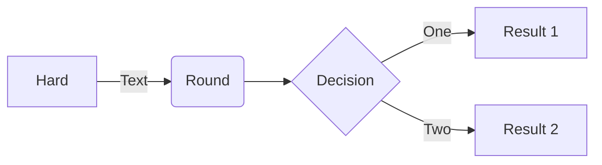

# Markdown

[Markdown](https://daringfireball.net/projects/markdown/) is a lightweight markup language with plain text formatting syntax. Docfx supports [CommonMark](https://commonmark.org/) compliant Markdown parsed through the [Markdig](https://github.com/xoofx/markdig) parsing engine.

Link to [Math Expressions](#math-expressions)

# Block Quotes

> This is a block quote.

## Alerts

> [!NOTE]
> Information the user should notice even if skimming.

> [!TIP]
> Optional information to help a user be more successful.

> [!IMPORTANT]
> Essential information required for user success.

> [!CAUTION]
> Negative potential consequences of an action.

> [!WARNING]
> Dangerous certain consequences of an action.

> [!TODO]
> This is a TODO.

## Image 


## Mermaid Diagrams

Flowchart



## Code Snippet

The example highlights lines 2, line 5 to 7 and lines 9 to the end of the file.

[!code-csharp[](media/Program.cs?highlight=2,5-7,9-)]

## Math Expressions

This sentence uses `$` delimiters to show math inline:  $\sqrt{3x-1}+(1+x)^2$

**The Cauchy-Schwarz Inequality**

$$\left( \sum_{k=1}^n a_k b_k \right)^2 \leq \left( \sum_{k=1}^n a_k^2 \right) \left( \sum_{k=1}^n b_k^2 \right)$$

This expression uses `\$` to display a dollar sign: $\sqrt{\$4}$

To split <span>$</span>100 in half, we calculate $100/2$

## Custom Syntax Highlighting

```bicep
resource storageAccount 'Microsoft.Storage/storageAccounts@2021-06-01' = {
  name: 'hello'
  // (...)
}
```

## Tabs

# [Linux](#tab/linux)

Content for Linux...

# [Windows](#tab/windows)

Content for Windows...

---

The above tab group was created with the following syntax:

```markdown
# [Linux](#tab/linux)

Content for Linux...

# [Windows](#tab/windows)

Content for Windows...

---
```

Tabs are indicated by using a specific link syntax within a Markdown header. The syntax can be described as follows:

```markdown
# [Tab Display Name](#tab/tab-id)
```

A tab starts with a Markdown header, `#`, and is followed by a Markdown link `[]()`. The text of the link will become the text of the tab header, displayed to the customer. In order for the header to be recognized as a tab, the link itself must start with `#tab/` and be followed by an ID representing the content of the tab. The ID is used to sync all same-ID tabs across the page. Using the above example, when a user selects a tab with the link `#tab/windows`, all tabs with the link `#tab/windows` on the page will be selected.

### Dependent tabs

It's possible to make the selection in one set of tabs dependent on the selection in another set of tabs. Here's an example of that in action:

# [.NET](#tab/dotnet/linux)

.NET content for Linux...

# [.NET](#tab/dotnet/windows)

.NET content for Windows...

# [TypeScript](#tab/typescript/linux)

TypeScript content for Linux...

# [TypeScript](#tab/typescript/windows)

TypeScript content for Windows...

# [REST API](#tab/rest)

REST API content, independent of platform...


---

Notice how changing the Linux/Windows selection above changes the content in the .NET and TypeScript tabs. This is because the tab group defines two versions for each .NET and TypeScript, where the Windows/Linux selection above determines which version is shown for .NET/TypeScript. Here's the markup that shows how this is done:

```markdown
# [.NET](#tab/dotnet/linux)

.NET content for Linux...

# [.NET](#tab/dotnet/windows)

.NET content for Windows...

# [TypeScript](#tab/typescript/linux)

TypeScript content for Linux...

# [TypeScript](#tab/typescript/windows)

TypeScript content for Windows...

# [REST API](#tab/rest)

REST API content, independent of platform...

---
```

## Details

<details>
<summary>Demo</summary>

```
root@server# apt-get install nano
```
</details>
