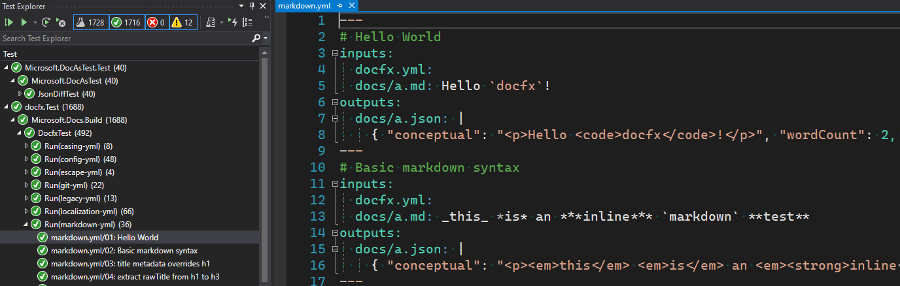

# Microsoft.DocAsTest

`Microsoft.DocAsTest` is a tool to write data driven tests using Markdown and YAML.



## Getting Started

# docastest-demo

1. Create a new class library

```cmd
dotnet new console
```

2. Add NuGet reference to `Microsoft.DocAsTest`

```cmd
dotnet add package Microsoft.DocAsTest --version 3.0.0-*
```

> Create a `NuGet.config` file, add docfx-v3 pre-release NuGet feed. This step is needed because we haven't shipped a NuGet release yet

```xml
<?xml version="1.0" encoding="utf-8"?>
<configuration>
    <packageSources>
        <add key="docfx-v3" value="https://www.myget.org/F/docfx-v3/api/v3/index.json" />
    </packageSources>
</configuration>
```

3. Create a test data contract that you wish to use to describe your test. Then create a public test method that contains logic to verify your test data contract. Attribute that method with `[YamlTest]` or `[MarkdownTest]` to specify the file glob pattern that contains the test data. The path is relative to project output directory, use `~/` to denote path relative to the current git repository.

```csharp
public class HelloTestSpec
{
    public string Input;
    public string Output;
}

public class HelloTest
{
    [YamlTest("~/*.yml")]
    [MarkdownTest("~/README.md")]
    public void Hello(HelloTestSpec spec)
    {
        Assert.Equal(spec.Output, $"Hello {spec.Input}");
    }
}

```

5. Create YAML test data. Each YAML test is a YAML fragment separated by `---`, the first comment appears as test description in Visual Studio test explorer.

```yml
# Hello YAML Test!  <-- hello.yml
input: YAML Test!
output: Hello YAML Test!
---
# Hello YAML Test 2
```

6. Create Markdown test data. Each markdown test is a YAML code fragment that starts with 6 or more backticks, to separate from normal code fragments.

``````````markdown
You can _also_ write test data in markdown files.

``````yml
input: Markdown Test!
output: Hello Markdown Test!
``````
``````````
