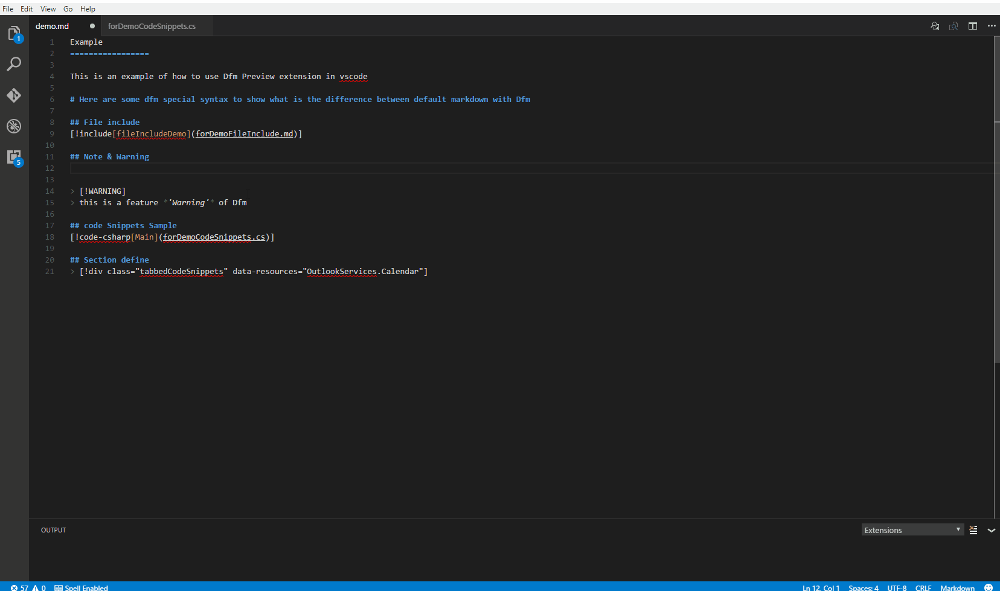
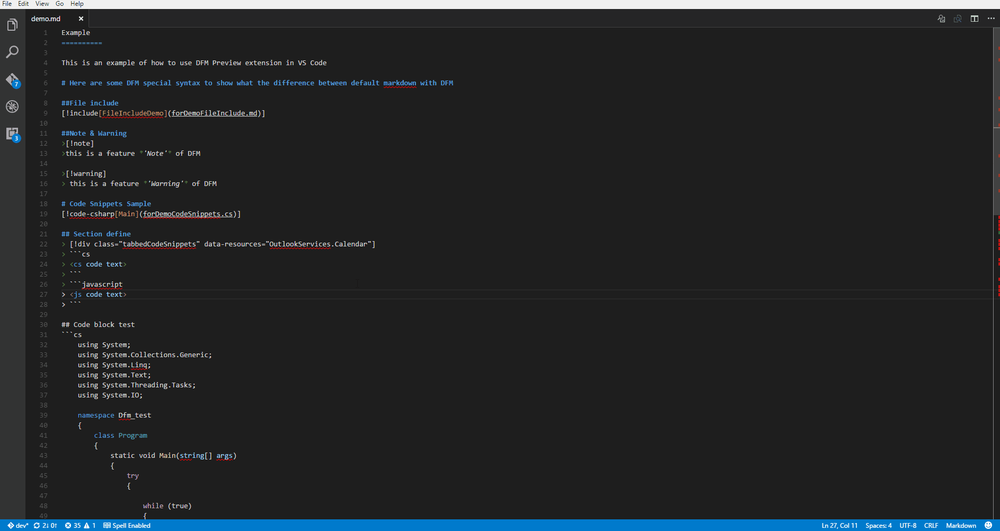
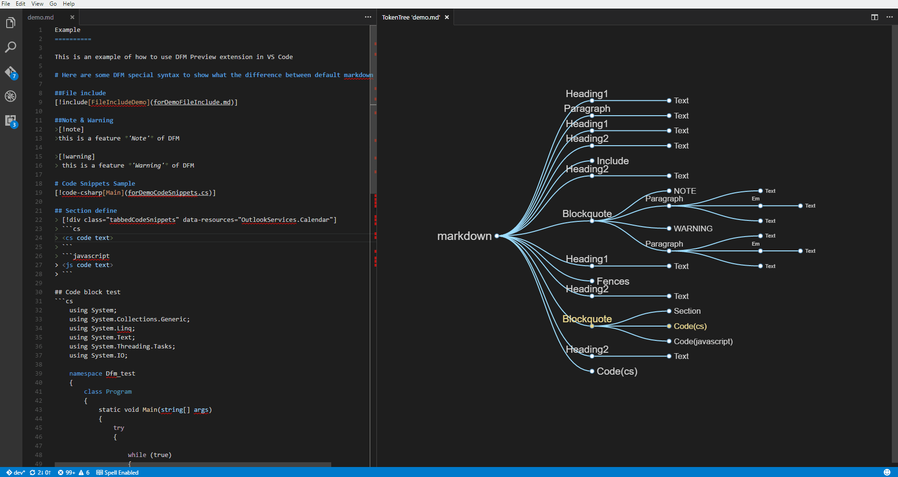

# DocFX Flavored Markdown Preview
------------

An extension to support [**DFM**](https://dotnet.github.io/docfx/spec/docfx_flavored_markdown.html) for Visual Studio Code! The preview provides the following features:

* Preview the `DFM` to the side
* Preview the `TokenTree` to the side
* Match the markdown file to the tokenTree node
* Match the tokenTree node to the markdown file

# Quick Start
* Install the extension
> **Note:** Upgrade to Visual Studio Code 1.3.0 or above.
* Open a markdown file which includes `DFM` syntax
* Use the `Preview` and `TokenTree`
> **Note:** If you want to use `DFM` features `File include` and `Code Snippets`, You have to open a folder which includes your target markdown files

# Document
For further information and details about DocFX Flavored Markdown, please reference [DocFX Flavored Markdown](https://dotnet.github.io/docfx/spec/docfx_flavored_markdown.html)

# Feature Details
## Live preview
| Shortcuts | command title | command |
|:-------|:--------|:--------|
| `ctrl+shift+q` | `Toggle Dfm Preview` | Preview  |
| `ctrl+k q` | `Open Dfm Preview to the side` | Preview to side |
|  | `show Dfm Show` | Show Source |

  

## Token tree
| Shortcuts | command title | command |
|:-------|:--------|:--------|
| `ctrl+shift+t` | `Open Dfm Preview to the side` | TokenTreeToSide  |

  - Expand and collapse the nodes by clicking the circle of node

  - Display the detailed information of node on mouseover

  

- Match between markdown file with tokenTree Node
  - Click/select the text you want to match to the tokenTree
    > You can select multiple lines.
  - Click the text of node to match to the markdown file

  

# Found a Bug?
Please file any issue through the [Github Issue](https://github.com/dotnet/docfx/issues) system.

# Development
* First install
  * Visual Studio Code(above 1.3.0)
  * Node.js(Npm included)

* To run and develop do the following:
  * Run  `npm install` under the root dir of this extension
  * Open in Visual Studio Code(run `code .` under the root dir of this extension)
    > Cannot find module 'vscode'? Run `npm run postinstall` under the root dir of this extension, according to [Cannot find module 'vscode' – where is vscode.d.ts now installed? #2810](https://github.com/Microsoft/vscode/issues/2810)
  * Press `F5` to debug

# Source
[docfx/src/VscPreviewExtension](https://github.com/dotnet/docfx/tree/dev/src/VscPreviewExtension)

# Licences
*DocFX* is licensed under the [MIT license](LICENSE).

# TODO
* Support `DFM` feature `YamlHeader`
* Support `DFM` feature `Cross Reference`
* Auto trigger the tokenTree refresh when the textEditor change
* `Cross-platform`
* User configurable
* Better preview match performance like default markdown extension of VS Code
